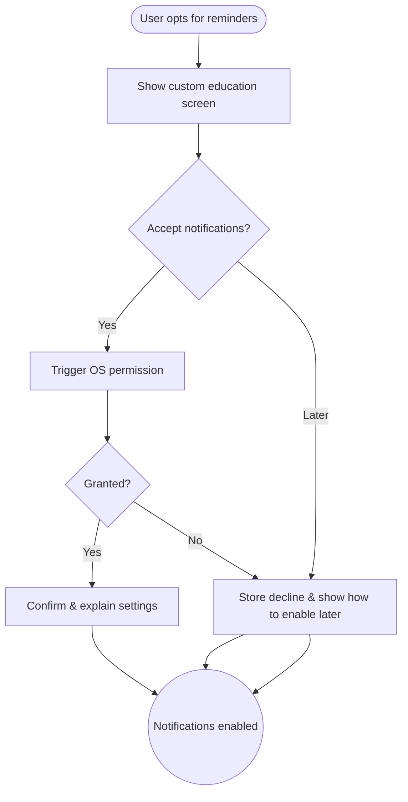

import FeatureSummary from '@site/src/components/FeatureSummary';

# Accept Notifications Screens

## One-Glance Summary

<FeatureSummary />

## Narrative
The Accept Notifications screens explain why reminders matter before the system dialog appears. We show how prompts support steady practice and share the privacy basics in clear language.

After the user taps Accept we launch the OS dialog and store the result. If they decline we respect the choice, record it, and point to settings for a future change.

## Interaction Blueprint
1. Detect engagement moment (post-practice) when a user expresses interest in reminders.
2. Show AWATERRA-designed screen summarizing benefits, examples, and privacy assurances.
3. Provide primary Accept CTA and secondary “Maybe later” option.
4. On Accept, launch the OS permission dialog and listen for the response.
5. Persist the result; if granted, send a confirmation and quick primer on managing preferences.
6. If declined, respect the choice and guide users to settings for future changes.

:::caution Edge Case
iOS allows only one request. We present the system prompt only after explicit user intent.
:::

:::tip Signals of Success
- Allow rate rises compared with baseline OS prompts.
- Users can restate the types of notifications we send.
- Declines stay low because we respect the answer and avoid nagging.
:::

### Journey

## Requirements & Guardrails
- **Acceptance criteria**
  - GIVEN a user taps Accept WHEN we invoke OS permission THEN analytics capture outcome and prevent duplicate prompts.
  - GIVEN a decline WHEN recorded THEN subsequent flows reference that state and avoid nagging.
  - GIVEN localization WHEN applied THEN messaging remains consistent across languages.
- **No-gos & risks**
  - Triggering OS dialog without context violates best practices and lowers allow rates.
  - Promising notifications we cannot deliver (e.g., immediate results beyond cadence).
  - Failing to route users to preference controls post-acceptance.

## Data & Measurement
- Primary metric: Permission allow rate from this flow.
- Secondary checks: Time between permission grant and first delivered notification, decline follow-up conversions, and feedback sentiment.
- Telemetry requirements: Log screen views, CTA selections, OS outcomes, and subsequent preference edits.

## Open Questions
- Should we tailor copy based on which notification categories the user expressed interest in?
- How do we support re-prompting strategies for users who initially choose “Maybe later” without harming experience?
