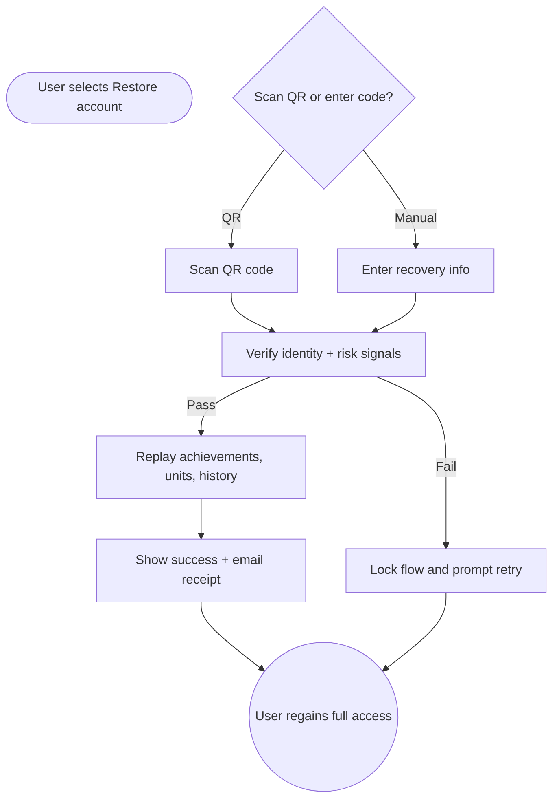

import FeatureSummary from '@site/src/components/FeatureSummary';

# Account Restoration Logic

## Summary

<FeatureSummary />

## Narrative
Account restoration protects the emotional investment users build with AWATERRA. A lightweight recovery entry point lets people scan a QR code or type their recovery phrase so we can rehydrate achievements, Lumens, and purchase history on any new device without support tickets.

The logic keeps the experience reassuring: we verify identity, replay the ledger, rebuild preferences, and only hand control back once every piece of progress is confirmed. Clear confirmations and optional email confirmations close the loop so users trust that nothing was lost.

## Interaction
1. User selects "Restore account" during onboarding and chooses between QR scan and manual recovery entry.
2. Client submits the recovery payload plus device fingerprint to the restoration service.
3. Service validates the payload, challenges for secondary confirmation if device risk is high, and blocks after repeated failures.
4. Once verified, the system rebuilds achievements, Lumens balance, transaction history, and personalized settings from the backups.
5. UI streams progress of each restoration module so the user knows what is happening in real time.
6. When replay completes, the new device signs in automatically and sends a confirmation email summarizing the assets restored.
7. Audit logs capture the new device ID, timestamp, and restored scopes for compliance.

:::caution Edge Case
If a network drop interrupts restoration, pause with a "Still restoring" banner and automatically resume from the last successful module once connectivity returns.
:::

:::tip Signals of Success
- Users finish restoration without contacting support.
- Lumens, achievements, and purchases match the previous device state.
- Recovery attempts that fail verification are throttled while legitimate ones complete quickly.
:::

## Journey

## Requirements
- **Acceptance criteria**
  - GIVEN a valid recovery payload WHEN the user completes verification THEN the new device displays their full history before leaving the flow.
  - GIVEN there is a mismatch in unit totals WHEN reconciliation runs THEN the system halts restoration and surfaces support guidance without corrupting data.
  - GIVEN multiple failed recovery attempts on the same device WHEN the threshold is crossed THEN rate limiting activates and the user receives a caution message.
- **No-gos & risks**
  - Restoring to compromised devices without verification puts user currency at risk.
  - Silent restoration failures erode trust; never dismiss the dialog until every module reports success.
  - Recovery payloads must never be logged or stored in analytics.

## Data
- **Primary metric:** Percentage of recovery sessions that finish successfully on the first attempt.
- **Secondary checks:** Restoration duration, rate-limited attempts, fallback resumes, and related support tickets.
- **Telemetry requirements:** Log flow entry, chosen method, verification outcomes (without secrets), module progress, retries, and completion timestamps.

## Open Questions
- Do we allow users to trigger restoration from Settings after they already completed onboarding?
- Should we force an email confirmation step before replaying units on a high-risk device?
