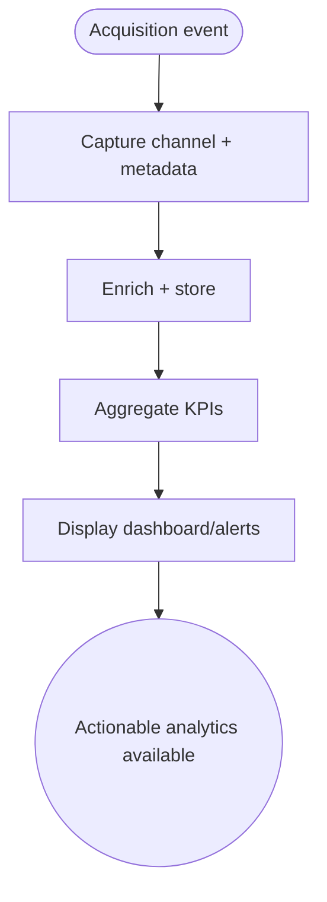

import FeatureSummary from '@site/src/components/FeatureSummary';

# Acquisition Analytics

## Summary

<FeatureSummary />

## Narrative
Ignition requires precise insight into how users discover AWATERRA. Acquisition Analytics collects channel data (organic, referral, paid), ties it to onboarding cohorts, and surfaces dashboards that highlight cost, conversion, and retention. Product and marketing teams rely on these views to tune campaigns and measure ROI.

## Interaction
1. Every acquisition event (install, signup, referral) generates a record with channel metadata.
2. ETL pipeline enriches records with geography, device, campaign, and subscription outcomes.
3. Warehouse aggregates daily/weekly cohorts.
4. Dashboard provides filters (channel, campaign, locale, version) plus KPI cards.
5. Teams export CSVs or connect BI tools for deeper analysis.
6. Alerts trigger when acquisition costs spike or conversion dips.
7. Historical data stores securely for longitudinal insights.

:::caution Edge Case
If attribution data is missing, records flag as “unknown” rather than guessing, ensuring honesty while prompting data fixes.
:::

:::tip Signals of Success
- Teams can identify top-performing channels quickly.
- Data latency stays within SLA (e.g., &lt;12h).
- Decisions (budget shifts, experiments) cite these dashboards.
:::

## Journey

## Requirements
- **Acceptance criteria**
  - GIVEN a new acquisition event WHEN processed THEN channel/campaign data appears on the dashboard within the reporting window.
  - GIVEN attribution data is missing WHEN ingestion happens THEN the record is flagged for remediation and excluded from channel totals until fixed.
  - GIVEN a KPI breaches configured thresholds WHEN alerts trigger THEN stakeholders receive context plus recommended checks.
- **No-gos & risks**
  - Mixing personally identifiable data with analytics without consent violates policy; keep datasets compliant.
  - Black-box attribution will erode trust; provide source definitions.
  - Latency beyond SLA renders the dashboard useless for campaign decisions.

## Data
- **Primary metric:** Reporting freshness (event-to-dashboard time).
- **Secondary checks:** Attribution coverage, alert accuracy, analyst satisfaction, export usage, and count of “unknown” records.
- **Telemetry requirements:** Log ingestion counts, enrichment success/failure, query performance, alert triggers, and remediation events for unknown data.

## Open Questions
- Do we integrate external ad platform spend data in v1.0 or treat it as manual input?
- Should the dashboard expose cohort retention curves or focus purely on acquisition KPIs?
