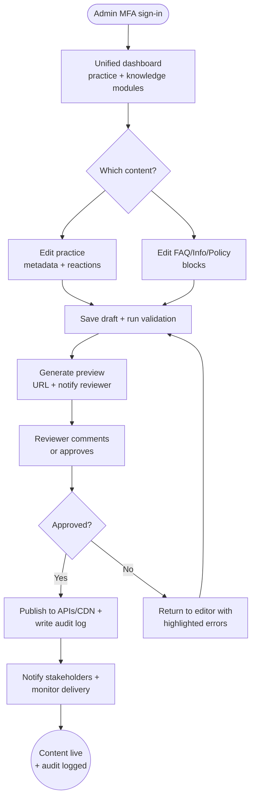

import FeatureSummary from '@site/src/components/FeatureSummary';

# Admin Area v0.2 (CRM/CMS)

## Summary

<FeatureSummary />

## Narrative
Admin Area v0.2 expands the internal CMS into the single cockpit for every copy-driven surface in release 0.2. The practice catalogue from v0.1 now sits alongside FAQ, Info, and legal entries (T&C, Privacy) so the operations team can refresh reactions, policies, or onboarding copy within minutes. Editors authenticate with MFA, see both practice and knowledge modules on the dashboard, and work through draft → review → publish flows without filing engineering tickets.

Entries inherit structured blocks—headlines, rich text, lists, embeds, and CTA links—so the app and docs render consistent layouts. Practice records gain reaction-tag metadata, letting catalogue cards, dashboards, and analytics share the same seven-state taxonomy. Every save produces a preview URL that mirrors production. Reviewers leave inline comments, approvals unlock publish, and the system snapshot diffs for accountability. Publishing pushes content to both mobile and docs APIs atomically and alerts support if anything fails validation.

## Interaction
1. Admin signs in (MFA enforced) and lands on the unified workspace dashboard with summary tiles for Practice Catalogue, FAQ, Info, and Policies plus review queues.
2. Picking a practice opens the extended form: core metadata, availability, media, and the new reaction-tag weights that map to the seven emotional states.
3. Choosing a knowledge page opens the block editor with section templates (hero, accordion, CTA) and metadata for locale, version, and visibility flags.
4. Saving runs validation (required fields, broken links, locale coverage, reaction taxonomy) and stores a draft revision with author + timestamp.
5. CMS generates a preview URL and pings assigned reviewers in Slack/email; reviewers comment or approve right inside the platform.
6. Approval unlocks Publish. Publishing pushes content to edge caches and the headless API, logs the revision diff, and notifies analytics so dashboards update.
7. Post-publish monitors confirm delivery; the system can roll back to the previous revision with one click while preserving the audit trail.

:::caution Edge Case
If validation finds missing locale variants or a reaction tag outside the allowed taxonomy, the CMS blocks publish, highlights failing fields, and keeps the draft so editors can fix without losing work.
:::

:::tip Signals of Success
- ≥90 % of FAQ/Info/Policy edits ship without engineer intervention.
- Practice reaction tags stay in sync across CMS, app catalogue, and analytics dashboards.
- Preview URLs match production rendering; reviewers catch issues before publish.
:::

### Journey

## Requirements
- **Acceptance criteria**
  - GIVEN an authenticated admin WHEN they open the dashboard THEN they see practice entries and knowledge pages with status, locale coverage, and pending review counts.
  - GIVEN an editor saves a knowledge-page draft WHEN validation passes THEN the system issues a preview URL, records the revision, and leaves production content unchanged until publish.
  - GIVEN a revision is approved WHEN Publish runs THEN APIs/CDN update atomically, audit trails capture author + diff, and downstream clients reflect the changes on the next sync.
  - GIVEN a practice’s reaction tagging is updated WHEN the change publishes THEN the practice list, history, and analytics endpoints expose the new tags within one refresh cycle.
- **No-gos & risks**
  - Skipping review for legal content; approvals are mandatory for T&C/Privacy updates.
  - Publishing without locale parity (e.g., missing Russian copy) which would blank in-app surfaces.
  - Divergent schemas between practice and knowledge APIs that break caching or analytics.

## Data
- Primary metric: Percentage of CMS updates completed end-to-end within SLA (practice ≤1 day, knowledge ≤2 days).
- Secondary checks: Validation error rate per revision, preview link usage, number of rollbacks, and publish-to-delivery latency.
- Telemetry requirements: Log draft creation, validation failures, reviewer actions, publish events, rollback events, and reaction tag changes (with old/new values).

## Open Questions
- Should legal edits require dual approval (legal + operations) before publish?
- Do we surface in-dashboard analytics for FAQ/Info engagement to guide prioritisation?
- How should we handle bulk reaction-tag edits when revamping the taxonomy?
