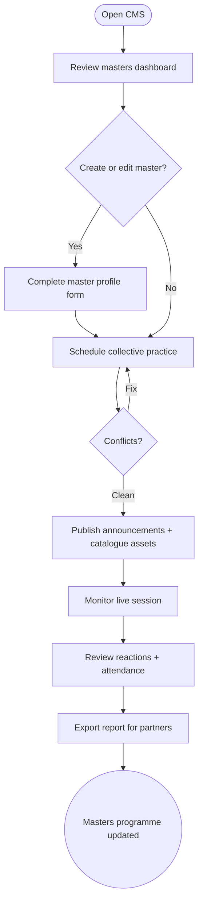

import FeatureSummary from '@site/src/components/FeatureSummary';

# Admin Area CMS v0.3 (Masters Management)

## Summary

<FeatureSummary />

## Narrative
Admin Area CMS v0.3 extends the internal tooling beyond practice catalogue maintenance so the team can shepherd master-led experiences end to end. The dashboard now opens with a Masters table that lists profile status, language coverage, next collective slot, and reaction health. Creating a master guides the operator through biography, portrait, social links, preferred time windows, and audio asset uploads. From there, the scheduler blocks collective practices: pick a date, choose the master’s planet visual, select supported languages, and attach the MP3 guidance the team already reviewed offline.

Each scheduled session generates the assets that user-facing features rely on—home view announcements, profile stories, practice list badges, and push templates. Reactive widgets flag conflicts (double-booked masters, overlapping collective windows) and ensure the pulse calculations know which practices should broadcast as collective energy. Operators can preview the announcement copy and countdown timers before publishing. After a session ends, the CMS stores aggregate reactions, participant counts, and follow/favourite numbers. A single "Share report" button packages the data for Master Analytics and the follow-up email that goes out to the partner.

## Interaction
1. Operator signs in and lands on the Masters dashboard filtered by upcoming sessions.
2. "Add master" opens a guided form for bio, voice asset, social links, preferred modalities, and language availability.
3. On save, the system generates a draft master card and prompts to schedule the first collective practice.
4. Scheduler selects date/time, duration, allowed reactions, capacity flags, calendar template, and preview text for announcements/push.
5. CMS validates overlaps, reserves a slot in AWA Pulse, and publishes pending assets to Home View and Practice List.
6. Once the collective ends, the system ingests reactions + attendance, surfaces them in the report tab, and exposes the export/share controls.

:::caution Edge Case
If a master is missing mandatory assets (audio, portrait, language), publishing should be blocked with human-friendly copy—never push an incomplete card to production.
:::

:::tip Signals of Success
- Masters can be onboarded within one working session without engineering help.
- Collective practices never overlap silently; conflicts are caught during scheduling.
- Reaction summaries and attendance exports are generated automatically after each session.
:::

### Journey

## Requirements
- **Acceptance criteria**
  - GIVEN a new master WHEN the form is completed THEN the CMS stores the record with validation for required fields and surfaces a preview card.
  - GIVEN a collective practice is scheduled WHEN the operator publishes THEN related user-facing assets (Home View stories, Practice List badge, push template) are generated and marked pending release.
  - GIVEN a session completes WHEN reactions and attendance ingest THEN the CMS shows the summary within five minutes and enables exports.
- **No-gos & risks**
  - Allowing overlapping collective windows for the same master or conflicting announcements.
  - Publishing assets without verifying audio files and translations.
  - Fragmented data export flows that force manual spreadsheet work.
- **Data**
  - Track time to onboard a master, number of edits per session, conflict rate, and percentage of sessions exported to partners.

## Open Questions
- Should masters have self-service access or do we keep CMS access internal only for v0.3?
- Do we need role-based permissions between content ops and analytics staff before expanding the team?
- How granular should conflict validation be (e.g., overlapping audiences vs exact time collisions)?
