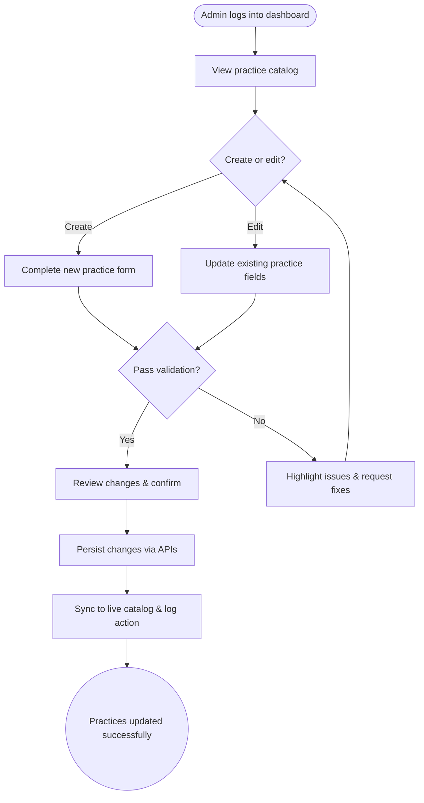

import FeatureSummary from '@site/src/components/FeatureSummary';

# Admin Area v0.1 (CRM/CMS)

## One-Glance Summary

<FeatureSummary />

## Narrative
Admin Area v0.1 gives AWATERRA staff a safe place to manage practices without touching production systems. Secure sign-in, clear catalog views, and simple forms let the team refresh guidance quickly.

This release covers the basics: edit metadata, publish or retire entries, and confirm that updates reach the app. Role checks and audit logs keep the workspace protected even as we move fast.

## Interaction Blueprint
1. Admin authenticates with elevated credentials and reaches the dashboard home.
2. Dashboard lists existing practices with status badges, search, and quick filters.
3. Admin chooses an item to edit or selects "Create practice" to open the guided form.
4. Changes are saved via secure APIs, validated, and reflected in preview state.
5. Admin confirms updates, publishes, or reverts as needed; audit trail stores the action.
6. System syncs updates to the live catalog and notifies relevant stakeholders.

:::caution Edge Case
Form validation fails because required fields are missing. The dashboard blocks submission, highlights the fields, and prevents publishing until everything is filled in.
:::

:::tip Signals of Success
- Admins complete practice CRUD without manual database access.
- Most edits finish in under five minutes from change to publish.
- Audit logs capture every create, update, and delete event.
:::

### Journey

## Requirements & Guardrails
- **Acceptance criteria**
  - GIVEN an authenticated admin WHEN they open the practice catalog THEN they see a searchable list with status, owner, and last-updated metadata.
  - GIVEN the admin submits a fully populated practice form WHEN the change is confirmed THEN the record is created or updated and visible in both dashboard and client app within a refresh cycle.
  - GIVEN the admin deletes a practice WHEN the action is confirmed THEN the item is marked inactive, logged, and removed from user-facing entry points.
- **No-gos & risks**
  - Never expose admin tools without MFA and role-based access control.
  - Avoid silent failures that overwrite content without alerting the editor.
  - Prevent destructive actions from bypassing audit logging or version history.

## Data & Measurement
- Primary metric: Admin task completion rate (create/update/delete) without engineering intervention (target ≥ 95 percent).
- Secondary checks: Median dashboard load under 2 seconds, number of validation errors per session, count of audit gaps.
- Telemetry requirements: Log every CRUD action with actor, timestamp, diff snapshot, and outcome; instrument dashboard performance and error events.

## Open Questions
- Do we need draft states and preview links before publishing in v0.1?
- How will we handle bulk updates or imports if the catalog scales beyond a few dozen practices?
- Which admins require approval workflows before destructive actions?
