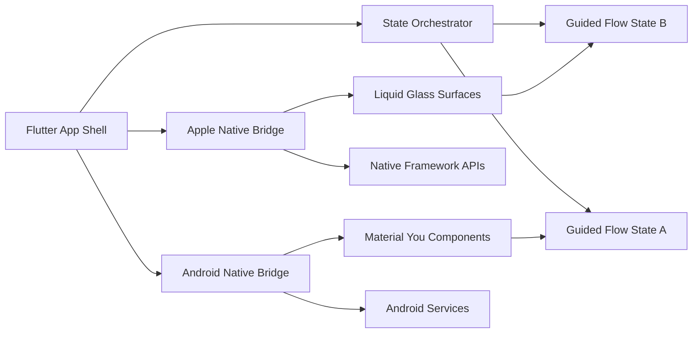

import FeatureSummary from '@site/src/components/FeatureSummary';

# App Architecture and Base

## Summary

<FeatureSummary />

## Narrative
App Architecture and Base supplies the structure every AWATERRA feature depends on. We harden the shell, connect platform services, and verify data flows so launches stay steady from the first release.

Defensive code and careful configuration protect user data while letting us move fast. Guardrails around caching, sync, and secrets mean new features can plug in without rebuilding the foundation.

The shared codebase is grounded in Flutter so we stay cross-platform while still leaning on native frameworks. We integrate Apple-specific capabilities such as Liquid Glass on iOS 16 alongside Material-driven components on Android by wrapping them behind Flutter channels and shared state contracts.

To preserve the seamless experience, flows prefer component states over hard page transitions. Architecture patterns account for stateful views, inline progressions, and orchestration layers that let users glide between steps without disorienting jumps.

## Interaction
1. Scaffold the project foundation, establish shared libraries, and document the conventions for new modules.
2. Configure secure service accounts, environment variables, and secrets management for all environments.
3. Connect to primary databases, run migrations, and validate schema availability during app bootstrap.
4. Implement critical boot-time services: authentication, storage access, data synchronization routines, and platform bridges for Apple and Android native APIs.
5. Exercise happy-path and failure-path launch scenarios to confirm graceful recovery and logging.
6. Publish architecture documentation and walkthroughs so engineering, QA, and ops share the same mental model.

:::caution Edge Case
A dependency initializes slowly and delays app launch. Introduce asynchronous loading with user-facing skeleton states while keeping integrity checks in place.
:::

:::tip Signals of Success
- Cold and warm launches complete within target thresholds across devices.
- Core services return healthy status codes right after deployment.
- Architecture docs stay current and unblock new contributors.
- Native bridges deliver identical behavior across Apple and Android test devices, including Liquid Glass surfaces on iOS.
:::

### Journey

## Cross-Platform Integration
- Flutter app shell orchestrates shared logic while channel bridges expose Apple and Google native capabilities.
- State orchestrator keeps users inside a single surface, swapping component states rather than navigating across disjoint screens.
- Platform adapters unlock Liquid Glass and other native effects on iOS while providing Material/Compose parity on Android.

## Requirements
- **Acceptance criteria**
  - GIVEN a clean install WHEN the app launches THEN all core services initialize without blocking errors.
  - GIVEN an environment change WHEN configuration is refreshed THEN secrets are loaded securely with no plaintext exposure.
  - GIVEN a schema migration WHEN the app restarts THEN data synchronization completes and surfaces health metrics.
  - GIVEN a native capability such as Liquid Glass on iOS or Material components on Android WHEN the Flutter shell invokes it THEN the bridge delivers a consistent API without forking experience logic.
  - GIVEN a multi-step flow WHEN components need to progress THEN the architecture swaps in-place states without forcing a disruptive page transition.
- **No-gos & risks**
  - Skipping documentation updates makes onboarding costly for new engineers.
  - Allowing silent failures during bootstrap hides configuration drift that could break production.
  - Weak secrets management or permissive service roles introduce avoidable security risk.
  - Fragmenting guided flows across multiple hard navigations breaks the seamless narrative we promise.

## Data
- Primary metric: Launch success rate across target devices and environments.
- Secondary checks: Average cold start duration, crash-free sessions, and configuration drift alerts.
- Telemetry requirements: Instrument boot checkpoints, configuration load outcomes, and service initialization timing.
