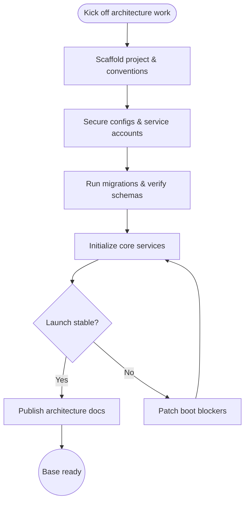

import FeatureSummary from '@site/src/components/FeatureSummary';

# App Architecture and Base

## One-Glance Summary

<FeatureSummary />

## Narrative
App Architecture and Base lays down the structural framework that every other AWATERRA feature relies upon. The team hardens the core application shell, wires in platform services, and verifies data flows so cold starts and background resumes feel stable from the very first release.

By coupling defensive coding patterns with rigorous environment configuration, the base layer keeps user data safe while still allowing rapid iteration. Guardrails around caching, synchronization, and secrets management ensure that downstream features can plug in without reinventing foundational plumbing.

## Interaction Blueprint
1. Scaffold the project foundation, establish shared libraries, and document the conventions for new modules.
2. Configure secure service accounts, environment variables, and secrets management for all environments.
3. Connect to primary databases, run migrations, and validate schema availability during app bootstrap.
4. Implement critical boot-time services: authentication, storage access, and data synchronization routines.
5. Exercise happy-path and failure-path launch scenarios to confirm graceful recovery and logging.
6. Publish architecture documentation and walkthroughs so engineering, QA, and ops share the same mental model.

- Edge case: A dependency initializes slower than expected, delaying app launch; introduce asynchronous loading with user-facing skeleton states while keeping integrity checks in place.

- Signals of success:
  - Cold and warm launches complete within acceptable thresholds across target devices.
  - Core services respond with healthy status codes immediately after deployment.
  - Architecture docs stay current and unblock new contributors.

### Mermaid Journey IN MERMAID FORMAT

## Requirements & Guardrails
- **Acceptance criteria**
  - GIVEN a clean install WHEN the app launches THEN all core services initialize without blocking errors.
  - GIVEN an environment change WHEN configuration is refreshed THEN secrets are loaded securely with no plaintext exposure.
  - GIVEN a schema migration WHEN the app restarts THEN data synchronization completes and surfaces health metrics.
- **No-gos & risks**
  - Skipping documentation updates makes onboarding costly for new engineers.
  - Allowing silent failures during bootstrap hides configuration drift that could break production.
  - Weak secrets management or permissive service roles introduce avoidable security risk.

## Data & Measurement
- Primary metric: Launch success rate across target devices and environments.
- Secondary checks: Average cold start duration, crash-free sessions, and configuration drift alerts.
- Telemetry requirements: Instrument boot checkpoints, configuration load outcomes, and service initialization timing.

## Open Questions
- Confirm which environments require automated smoke tests before promoting releases.
- Define ownership for keeping architecture documentation current as services evolve.
