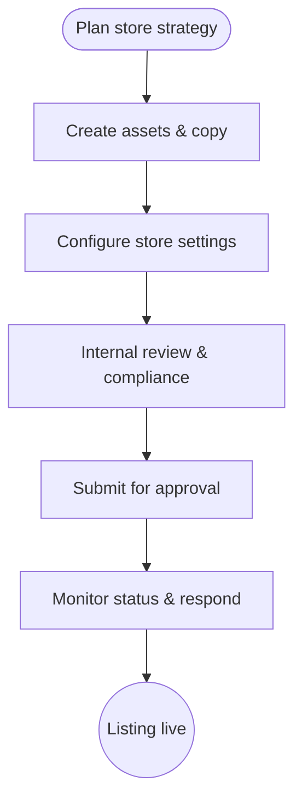

import FeatureSummary from '@site/src/components/FeatureSummary';

# App Store Presence

## Summary

<FeatureSummary />

## Narrative
App Store Presence makes sure AWATERRA's listing matches the product. We prepare visuals, copy, and compliance checklists so the store page feels calm and clear.

Smooth release workflows and timely reviews prevent approval delays. A polished listing helps users grasp the value and supports conversion.

## Interaction
1. Draft positioning statements, screenshots, and preview videos that align with brand tone.
2. Localize metadata for supported languages, including subtitle, keywords, and description.
3. Configure App Store Connect settings: bundle identifiers, pricing, territories, and age ratings.
4. Integrate review checklists (privacy manifests, ATT rationale, contact information).
5. Run internal reviews and legal/brand approvals before submission.
6. Schedule releases, monitor review status, and respond to feedback post-launch.

:::caution Edge Case
Store rejection cites a policy issue. Maintain a rapid escalation path with corrected assets or clarifications.
:::

:::tip Signals of Success
- Listing wins approval on the first submission with minimal revisions.
- View-to-install conversion stays healthy because messaging and visuals resonate.
- Updates land on time with product releases and campaigns.
:::

### Journey

## Requirements
- **Acceptance criteria**
  - GIVEN assets WHEN exported THEN they meet platform specs (sizes, formats) and pass QA.
  - GIVEN metadata WHEN localized THEN translations are accurate and culturally appropriate.
  - GIVEN submission WHEN sent THEN privacy disclosures and policy texts are complete.
- **No-gos & risks**
  - Misrepresenting product capabilities leading to bad reviews or rejection.
  - Missing legal copy (privacy policy, support contact).
  - Allowing outdated screenshots to linger after major redesigns.

## Data
- Primary metric: Conversion rate from store impressions to installs.
- Secondary checks: Review sentiment, approval turnaround time, and listing update cadence.
- Telemetry requirements: Track asset versioning, submission timestamps, and review outcomes.

## Open Questions
- Which seasonal moments or feature launches warrant alternative store creatives?
- Do we invest in App Store A/B testing (Product Page Optimization) in v0.1?
