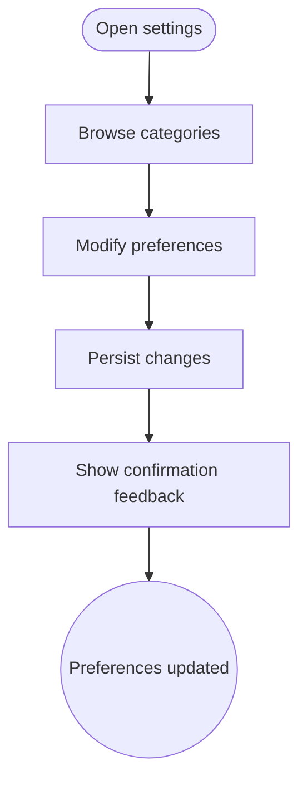

import FeatureSummary from '@site/src/components/FeatureSummary';

# Application Settings

## One-Glance Summary

<FeatureSummary />

## Narrative
Application Settings gathers the controls practitioners use to personalize AWATERRA. Clear sections cover biometric login, language, notifications, and profile data so updates stay calm and easy.

The module also holds compliance actions such as profile deletion and data requests. We link to GDPR flows directly so users can manage responsibilities without leaving the screen.

## Interaction Blueprint
1. Present categorized settings (Account, Security, Notifications, Language, Location) with intuitive icons.
2. Enable quick toggles for biometric login, push preferences, and quiet hours with immediate feedback.
3. Provide language selector leveraging localization infrastructure to refresh UI text live.
4. Surface location and data-consent controls referencing the Access features for transparency.
5. Offer destructive actions (Delete profile) with confirmation dialogs and supporting explanations.
6. Persist changes to backend and local storage, then notify dependent services to honor the new configuration.

:::caution Edge Case
Network loss happens mid-update. Queue changes locally and prompt the user when sync completes or fails.
:::

:::tip Signals of Success
- Settings adjust instantly without needing an app restart.
- Users know how to undo or revisit every change they make.
- Sensitive actions include safeguards that prevent accidental data loss.
:::

### Journey

## Requirements & Guardrails
- **Acceptance criteria**
  - GIVEN a user toggles biometric login WHEN the change is saved THEN the next authentication flow reflects the new method.
  - GIVEN a language switch WHEN applied THEN UI text updates immediately and persists across sessions.
  - GIVEN a destructive action WHEN confirmed THEN the user receives final confirmation and undo is not available unless specified.
- **No-gos & risks**
  - Burying critical privacy controls deep in submenus.
  - Saving partial updates that leave the system in inconsistent state.
  - Mixing tone or terminology that violates the mindful brand voice.

## Data & Measurement
- Primary metric: Successful settings update rate without generating support tickets.
- Secondary checks: Frequency of biometric enablement, language changes, and deletion requests initiated from settings.
- Telemetry requirements: Log view events, preference updates, error states, and completion confirmations.

## Open Questions
- Should we allow settings search in v0.1 or rely on curated sections?
- How do we surface upcoming features (e.g., subscription tiers) without cluttering the interface?
