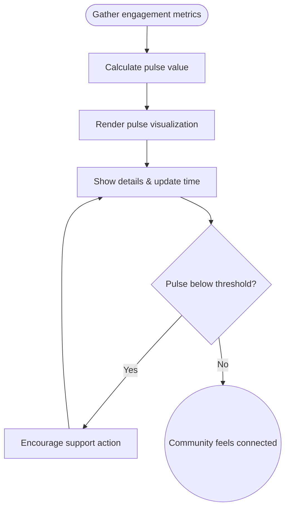

import FeatureSummary from '@site/src/components/FeatureSummary';

# AWA Pulse (Basic)

## One-Glance Summary

<FeatureSummary />

## Narrative
AWA Pulse translates community activity into a living heartbeat. By sampling engagement metrics and projecting them into a mindful visual, users can sense when the collective energy soars or needs attention. When levels dip, gentle prompts encourage supportive practice rather than triggering alarm.

The basic version focuses on clarity: a prominent BPM-style indicator, supporting trends, and contextual copy that explains what action helps. The visualization bridges analytics and emotion—grounding the product’s promise that every practice matters.

## Interaction Blueprint
1. Stream defined engagement metrics (finishes, streaks, active sessions) into the Pulse service.
2. Apply the agreed formula to convert metrics into a normalized heartbeat value.
3. Render the pulse visualization with smooth transitions and subtle haptics.
4. Annotate the UI with last update time, contributor count, and guidance if the pulse runs low.
5. Log user interactions (expanding details, tapping CTA) for insight into engagement.
6. Trigger low-pulse alerts to other channels (push, in-app) when thresholds are crossed.

- Edge case: Data spikes or outages could produce unrealistic pulse swings; clamp ranges and fail gracefully with calming copy when feeds degrade.

- Signals of success:
  - Pulse values refresh within SLA after new practice events.
  - Users understand the meaning of the metric and respond to low-pulse nudges.
  - Visualizations maintain smooth animation without motion sickness.

### Mermaid Journey IN MERMAID FORMAT

## Requirements & Guardrails
- **Acceptance criteria**
  - GIVEN fresh engagement data WHEN the pulse service updates THEN UI reflects the new value within the defined latency budget.
  - GIVEN pulse dips below threshold WHEN alerts trigger THEN copy stays supportive and links to meaningful actions.
  - GIVEN accessibility reviews WHEN motion is evaluated THEN animations offer reduced-motion alternatives.
- **No-gos & risks**
  - Exposing raw metrics without context can induce anxiety; keep storytelling centered on collective care.
  - Latency or stale data undermines trust in the heartbeat metaphor.
  - Overly aggressive alerts feel spammy and may push users away.

## Data & Measurement
- Primary metric: Percentage of sessions where pulse data is up-to-date (within X minutes of real time).
- Secondary checks: Low-pulse recovery rate after notifications, detail expansion engagement, and qualitative feedback on clarity.
- Telemetry requirements: Log calculation timestamp, render duration, threshold crossings, and CTA interactions.

## Open Questions
- What exact formula and normalization window best represent community vitality for launch?
- Do we surface historical trends (day/week) in v0.1 or keep the interface purely in the moment?
