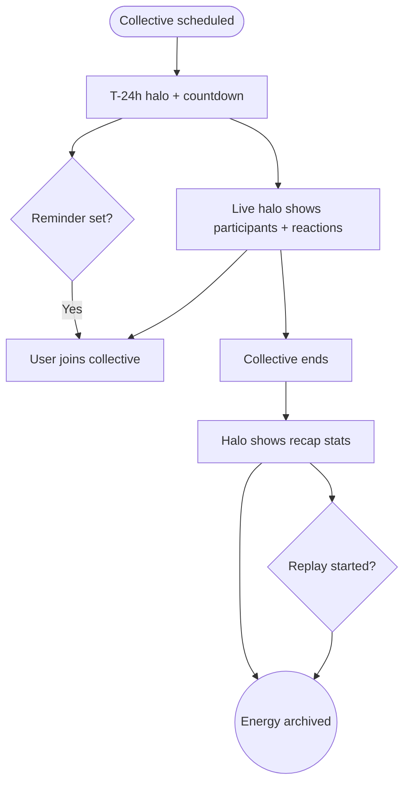

import FeatureSummary from '@site/src/components/FeatureSummary';

# AWA Pulse v0.3 (Master & Collective Layer)

## Summary

<FeatureSummary />

## Narrative
The v0.3 pulse introduces master-specific energy signatures so users instantly sense when a collective is approaching or underway. Twenty-four hours before start, the globe sprouts a soft beacon around the master’s home planet—pulled from CMS metadata—and overlays a countdown ribbon. Hovering or tapping reveals the master’s name, theme, language availability, and a "Remind me" hook that feeds push notifications. As the start time nears, the halo thickens and participant streaks flow toward the master planet, signalling arrivals.

During the session the pulse switches to live telemetry: participant counts update in near-real time, reactions spark as coloured motes that fly toward the centre, and the mini-map on the practice screen mirrors the same flow. After the collective, the halo cools yet stays visible for 24 hours with summary stats (total attendees, dominant reaction, AU contributed). The pulse data fuels Home View stories and Practice History so everything feels connected.

## Interaction
1. CMS schedules a collective; the pulse receives the session payload with start/end, master ID, and language tags.
2. At T-24h, the globe renders a pending halo with countdown tooltip and invites users to set reminders or add to calendar.
3. At T-30m, the halo intensity increases and connected users see a "Join soon" toast on Home View.
4. When the practice starts, live participants animate into the halo; reaction motes (coloured per taxonomy) stream out as people react.
5. After the session closes, the halo locks into a calm ring showing total attendees and the leading reaction colour; tapping opens the practice recap.
6. At T+24h, the halo retires unless the practice remains on-demand, at which point the recap link persists without countdown cues.

:::caution Edge Case
If live telemetry drops, freeze the halo with the last known count and display "Live data paused" rather than jittering inaccurate numbers.
:::

:::tip Signals of Success
- Reminder taps and calendar adds climb as users notice the globe halo well before start time.
- During live sessions, latency between participant join and globe animation stays under two seconds.
- Post-session recaps convert viewers into replay listeners within the 24-hour window.
:::

### Journey

## Requirements
- **Acceptance criteria**
  - GIVEN a collective practice WHEN it is within 24 hours of start THEN the globe renders the master halo with accurate countdown and metadata.
  - GIVEN the practice is live WHEN a user joins THEN participant counts and reaction motes update within two seconds of telemetry events.
  - GIVEN the session ends WHEN recap data is available THEN the halo displays total attendees, dominant reaction, and AU contribution for 24 hours.
- **No-gos & risks**
  - Showing inaccurate attendance numbers due to delayed telemetry.
  - Overloading the globe with multiple concurrent halos; ensure stacking logic stays calm.
  - Countdown states that clash with accessibility (e.g., unreadable contrast for colourblind users).
## Data
- **Primary metric:** Reminder opt-ins and live participant peaks driven by halo states.
- **Secondary checks:** Reaction distribution per collective, recap tap-through, replay starts from the halo, and telemetry dropout incidents.
- **Telemetry requirements:** Log halo lifecycle events, countdown timers, reminder actions, live participant deltas, reaction motes, and recap CTA taps.

## Open Questions
- Do we stack halos for simultaneous collectives or limit to one featured master at a time?
- Should we personalise halo visibility based on language preferences or always show the global feed?
- How do we treat small private collectives—do they appear on the globe or stay invite-only?
