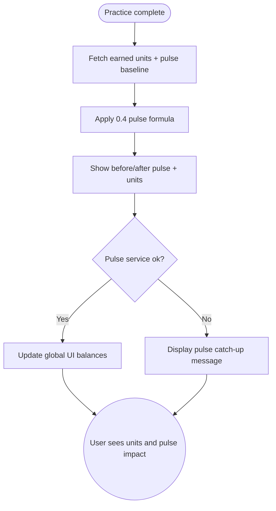

import FeatureSummary from '@site/src/components/FeatureSummary';

# AWA Pulse 0.4 with Lumens Formula

## Summary

<FeatureSummary />

## Narrative
This release connects the community pulse to the personal currency moment. Every completed practice now calculates both the increment in Lumens and the delta applied to the shared Pulse visualization, so users instantly sense their contribution.

The UI compares before-and-after values, shows how many units flowed into their balance, and animates the live Pulse to reinforce impact. This reinforces the idea that mindful action feeds the collective heartbeat and personal reserves simultaneously.

## Interaction
1. User completes any practice and lands on the post-practice screen.
2. Client requests the units earned plus the latest pulse value before the update.
3. Pulse service applies the 0.4 formula to translate the new practice into pulse delta and returns both the previous and new pulse states.
4. UI displays a comparison card with units earned, previous total, new total, and the animated pulse change.
5. User reviews supporting copy that explains why the change happened and how to earn more.
6. Totals update across the app (profile chips, header balances, map overlays) so the currency feels cohesive.
7. Feed/log entries capture the event for later review or analytics.

:::caution Edge Case
If the pulse service fails, still grant units instantly and surface a "Pulse catch-up" label so users know their contribution counted while visualization retries.
:::

:::tip Signals of Success
- Users immediately understand how many units were added and how the pulse moved.
- Pulse visualization animates within latency targets and mirrors ledger values.
- Drop-offs from the post-practice screen remain low because reinforcement lands quickly.
:::

## Journey

## Requirements
- **Acceptance criteria**
  - GIVEN a practice completes WHEN the response returns THEN units earned and pulse delta appear together within the same confirmation state.
  - GIVEN the pulse formula output exceeds defined bounds WHEN we render THEN values are clamped and annotated instead of flickering.
  - GIVEN the pulse service errors WHEN the UI handles the callback THEN users still receive the earned units and messaging explains that visualization will catch up.
- **No-gos & risks**
  - Showing mismatched unit totals versus ledger undermines trust in the economic model.
  - Hiding the "before" state deprives users of the comparison they need to internalize impact.
  - Overly intense animations may fatigue sensitive users; respect motion settings.

## Data
- **Primary metric:** Percentage of sessions where pulse delta and units display within two seconds of completion.
- **Secondary checks:** Feedback module comprehension, number of catch-up states, tap-through to learn more, and animation errors.
- **Telemetry requirements:** Log baseline pulse, delta, units granted, latency, visualization errors, and fallback banner usage.

## Open Questions
- Do we localize the formula explanation in this release or keep copy minimal?
- Should the comparison card be dismissible or persist until the user navigates away?
