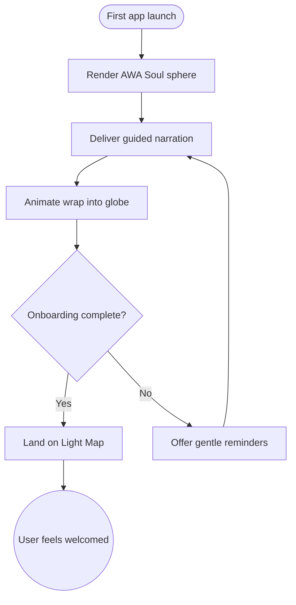

import FeatureSummary from '@site/src/components/FeatureSummary';

# AWA Soul

## One-Glance Summary

<FeatureSummary />

## Narrative
AWA Soul is the luminous ambassador that welcomes every newcomer. Rendered as a living sphere of 50,000 shimmering points, it breathes, responds, and narrates the journey from onboarding into first practice. The character personifies AWATERRA’s promise: you’re joining a global constellation of mindful practitioners.

Beyond visual poetry, AWA Soul provides clear guidance, sets expectations, and gently encourages commitment. As onboarding concludes, the entity expands to wrap the 3D globe, reminding users that their light contributes to a shared field of energy.

## Interaction Blueprint
1. Detect first-launch or guided practice scenarios that require the AWA Soul introduction.
2. Render the pulsing light sphere with breathing motion and adaptive brightness.
3. Deliver scripted narration—voice or text—coordinated with particle emphasis and formations.
4. Transition from onboarding steps into the Light Map, animating AWA Soul as it envelops the globe.
5. Respond to user interactions (tap, swipe, dwell) with subtle animation changes that reinforce presence.
6. Persist the user’s onboarding completion so subsequent sessions start in the standard home experience.

- Edge case: Device performance limits particle effects; degrade gracefully to fewer points while preserving breathing and narration.

- Signals of success:
  - New users complete onboarding with comprehension of AWATERRA’s mission.
  - Interaction logs show engagement with AWA Soul’s prompts vs. skips.
  - Visual transitions run smoothly on target hardware ranges.

### Mermaid Journey IN MERMAID FORMAT

## Requirements & Guardrails
- **Acceptance criteria**
  - GIVEN a new user WHEN the app opens THEN AWA Soul greets them with narration and responsive animation.
  - GIVEN animation playback WHEN the user interacts THEN feedback (point clustering, brightness shifts) reflects that attention.
  - GIVEN onboarding completion WHEN the user returns THEN AWA Soul resumes in-context guidance rather than repeating the full sequence.
- **No-gos & risks**
  - Overly intense visuals or audio that overwhelm sensitive users.
  - Long load times that break immersion before the greeting begins.
  - Localization gaps that make guidance inaccessible in the user’s language.

## Data & Measurement
- Primary metric: Onboarding completion rate driven by AWA Soul’s guided flow.
- Secondary checks: Average dwell time with the character, skip rates, and drop-off points per narration step.
- Telemetry requirements: Log scene transitions, interaction events with the sphere, and animation performance metrics.

## Open Questions
- Should AWA Soul’s script adapt based on user-selected intent or language preferences in v0.1?
- How do we maintain narrative freshness for returning users who revisit the guidance flow?
