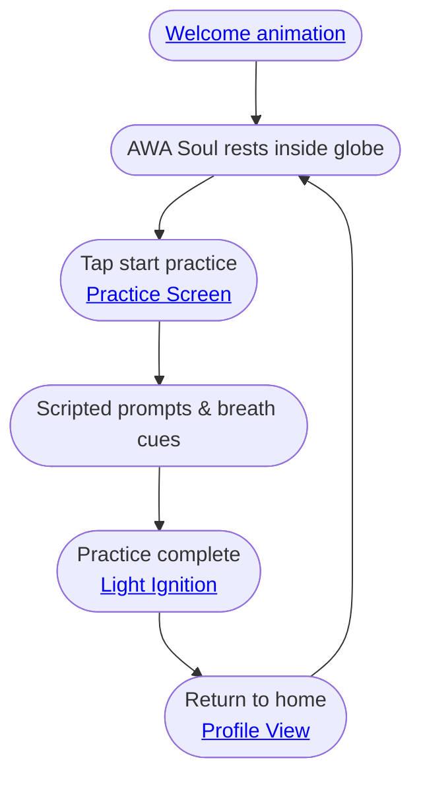

import FeatureSummary from '@site/src/components/FeatureSummary';

# AWA Soul

## Summary

<FeatureSummary />

## Narrative
AWA Soul is AWATERRA’s luminous guide. Inspired by calm voice assistants such as Siri or ChatGPT Voice, it looks and moves like an ambient AI, yet every line is scripted by the team. During the [Welcome Animation](./welcome-animation.md) the sphere types and speaks with a shimmering cadence, then stays available throughout the journey. The same avatar that breathes through [Light Ignition](./light-ignition.md) lifts from the globe, introduces itself, and invites the user to settle in.

After onboarding, AWA Soul rests within the [Globe](./globe.md) until a practice begins. When the user taps `Начать практику`, the guide rises from the globe into the [Practice Screen](./practice-screen.md), delivers the pre-authored prompts, and then gently dissolves back into the globe once the session completes. This continuity lets the user feel a single, caring presence instead of disconnected screens.

:::note Scripted Guidance
AWA Soul’s dialogue is pre-authored. The assistant-like visuals signal warmth and presence without implying generative AI or unscripted responses.
:::

## Interaction
1. During the welcome animation, lift AWA Soul from Light Ignition, render the shimmering type-to-reveal UI, and greet the user by name while staying on the same canvas.
2. As onboarding ends, fold AWA Soul back into the [Globe](./globe.md) so it can rest at the heart of [Profile View](./profile-view.md) without vanishing.
3. When the user starts a practice, raise AWA Soul out of the globe, transition the scene into the [Practice Screen](./practice-screen.md), and shift the UI into assistant mode (voice waveform-inspired visuals with scripted typewriter captions).
4. Guide the practice with contextual prompts—breath cues, reflections, timing—and react to user interactions (pauses, skips) with subtle brightness or position changes.
5. On practice completion, acknowledge the effort, trigger [Light Ignition](./light-ignition.md), and dissolve AWA Soul back into the globe so the home view is already updated.
6. Store the user’s progress state so AWA Soul skips repetitive greetings yet stays ready to surface micro-prompts or reminders when the app relaunches.

:::caution Edge Case
Users may jump straight into practice before onboarding finishes. Ensure AWA Soul can pivot smoothly into assistant mode without replaying the full welcome script.
:::

:::tip Signals of Success
- Users recognize AWA Soul as a single companion from welcome through practice without visual breaks.
- Practice guidance receives positive feedback and low skip rates.
- Transitions in and out of assistant mode complete under one second on target hardware.
:::

### Journey

## Requirements
- **Acceptance criteria**
  - GIVEN the welcome animation plays WHEN AWA Soul greets the user THEN the scripted lines render with assistant-style motion while staying on the same canvas.
  - GIVEN the user starts a practice WHEN AWA Soul rises from the globe THEN the transition to the Practice Screen completes in under one second and the scripted prompts begin immediately.
  - GIVEN a practice completes WHEN Light Ignition triggers THEN AWA Soul acknowledges the finish and settles back into the globe without lingering overlays.
  - GIVEN the user resumes the app WHEN onboarding is already complete THEN AWA Soul surfaces only contextual micro-prompts, not the entire welcome script.
- **No-gos & risks**
  - Hinting at unscripted or generative responses when the copy is fixed.
  - Overly intense visuals or audio that overwhelm sensitive users.
  - Long load times that break immersion before the greeting or practice guidance begins.

## Data
- Primary metric: Percentage of sessions where AWA Soul successfully transitions from welcome to practice without visual gaps.
- Secondary checks: Practice guidance completion rate, skip rate of scripted prompts, and latency of transitions in/out of assistant mode.
- Telemetry requirements: Log trigger events (welcome, practice start, practice end), animation timing, and prompt consumption metrics.

## Related Feature Docs
- [Welcome Animation](./welcome-animation.md) — surfaces the first scripted conversation.
- [Light Ignition](./light-ignition.md) — visual heartbeat that pairs with AWA Soul’s wrap-up.
- [Globe](./globe.md) — resting state for AWA Soul between sessions.
- [Profile View](./profile-view.md) — home canvas where the guide waits before each practice.
- [Practice Screen](./practice-screen.md) — stage for scripted guidance during sessions.

## Open Questions
- Should AWA Soul’s script adapt based on user-selected intent or language preferences in v0.1?
- How do we keep the scripted guidance fresh for returning practitioners without implying AI improvisation?
