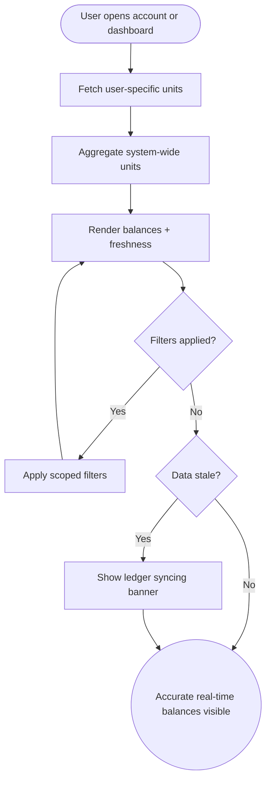

import FeatureSummary from '@site/src/components/FeatureSummary';

# Lumens Base and Controls

## Summary

<FeatureSummary />

## Narrative
The base controls establish a single ledger for Lumens so every surface can trust the balances it shows. When someone opens account details or a reporting dashboard we immediately hydrate their personal balance together with the global supply, letting teammates connect engagement health with currency velocity.

This feature also introduces the filtering, refresh cadence, and guardrails that keep data truthful. Operators can switch between individual users, segments, or global totals without waiting for exports, while the service reconciles new events in the background and flags mismatches before they leak into the UI.

## Interaction
1. User opens an account record or the reporting dashboard and the client requests both personal and system totals.
2. Service retrieves the latest user-specific unit balance from the ledger service and attaches source timestamps.
3. System aggregates total units across all users, honoring any filters or scopes the viewer selects.
4. UI renders per-user, filtered cohort, and global totals side by side with freshness indicators.
5. Automatic refresh runs on the agreed interval and replays deltas instead of full loads to stay responsive.
6. User applies filters for geography, timeframe, or activity type to narrow the totals and exports if needed.
7. Audit logs capture every refresh, filter change, and export to keep the ledger traceable.

:::caution Edge Case
If ledger reconciliation detects a mismatch between user balance and system totals, freeze the controls, display a "Ledger syncing" banner, and surface the latest consistent snapshot until replay completes.
:::

:::tip Signals of Success
- Operators reconcile user balances against the system total without manual spreadsheets.
- Filters respond quickly enough that analysts prefer the in-product dashboard over ad-hoc queries.
- Freshness indicators routinely stay inside the real-time SLA.
:::

## Journey

## Requirements
- **Acceptance criteria**
  - GIVEN an operator views any account WHEN the ledger responds THEN the per-user and system totals match within rounding tolerance and show the same timestamp.
  - GIVEN the user adjusts filters WHEN the query completes THEN both per-user and aggregate figures refresh without reloading the page.
  - GIVEN the ledger lags beyond the SLA WHEN freshness drops THEN the UI communicates the stale state and pauses exports.
- **No-gos & risks**
  - Double counting events or replaying stale cache values risks eroding trust in the currency.
  - Hiding reconciliation errors can block finance and product decisions.
  - Unbounded filters could trigger expensive scans; keep guardrails and pagination in place.

## Data
- **Primary metric:** Percentage of dashboard sessions with balances updated inside the real-time SLA.
- **Secondary checks:** Filter latency, audit-log coverage, reconciliation alert count, and export success rate.
- **Telemetry requirements:** Log ledger query duration, user/system balance values, filter parameters, snapshot IDs, and fallback banners displayed.

## Open Questions
- Do we cap filter combinations for the first release or allow free-form queries?
- What SLA do finance and product need for "real-time" in this phase?
