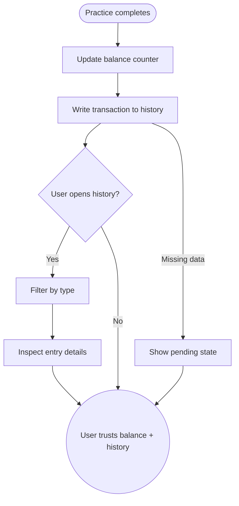

import FeatureSummary from '@site/src/components/FeatureSummary';

# Points Counter (Lumens) & History

## Summary

<FeatureSummary />

## Narrative
The points counter gives users a trusted place to see every Lumens they have earned or spent. It pairs a prominent balance with a chronological history, making progress tangible and motivating.

History entries show source (practice, referral, spend), amounts, and resulting totals so users can trace how their currency flows over time.

## Interaction
1. After each practice completion the counter updates with the new balance.
2. Transaction history logs the earning event with timestamp, source, and before/after totals.
3. User can open the history drawer from profile or rewards to browse past entries.
4. Filters allow users to view only earnings, spending, or transfers.
5. Each entry links to the originating feature (practice recap, referral list, spend confirmation).
6. Balance chip across the app stays synced through the shared counter service.
7. Export/share option lets users send their history to support if needed.

:::caution Edge Case
If an entry cannot be reconciled (e.g., missing metadata), flag it with "Pending" status, hide it from exports, and link to support until resolved.
:::

:::tip Signals of Success
- Users can explain why their balance changed without contacting support.
- History loads quickly even for heavy users.
- Pending states remain rare and resolve automatically.
:::

## Journey

## Requirements
- **Acceptance criteria**
  - GIVEN a new transaction posts WHEN the counter updates THEN both balance and history reflect the change within the same refresh cycle.
  - GIVEN the user filters the history WHEN results appear THEN the counts and totals adjust to match the filter without reloading the page.
  - GIVEN a transaction is pending reconciliation WHEN it appears THEN it is labeled clearly with status, timestamp, and expected resolution.
- **No-gos & risks**
  - Aggregating balances client-side risks divergence; always rely on the ledger service.
  - Lacking pagination could make large histories unusable.
  - Unclear labeling of spending transactions could make users think they lost units.

## Data
- **Primary metric:** Successful history load rate (sessions without errors).
- **Secondary checks:** Fetch latency, pending entry count, export usage, and related support contacts.
- **Telemetry requirements:** Log balance values, transaction types, filter usage, pagination, export triggers, pending labels, and resolution timestamps.

## Open Questions
- Do we allow users to delete or hide specific history entries?
- Should we highlight milestone totals (e.g., first 100 units) inside the history list?
