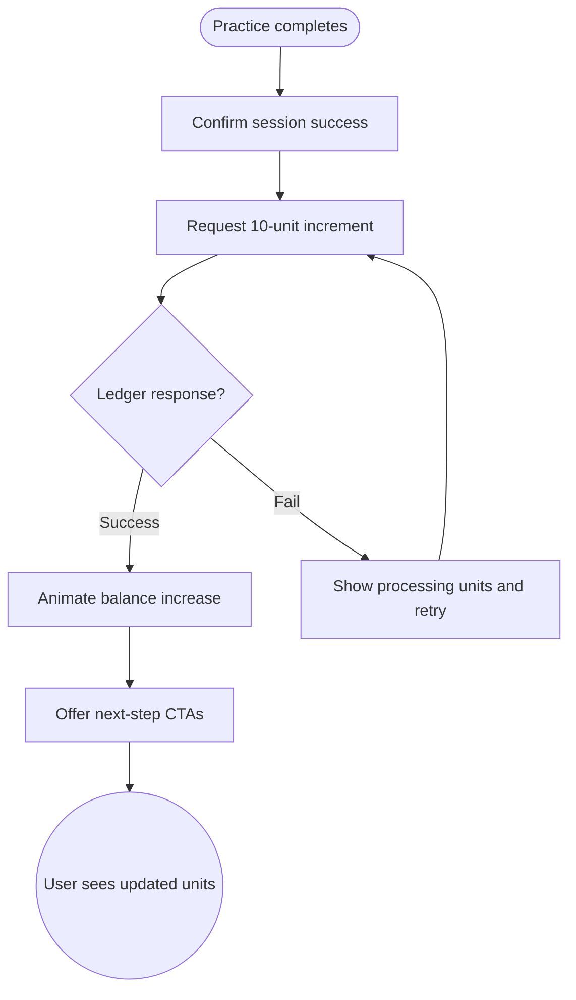

import FeatureSummary from '@site/src/components/FeatureSummary';

# Lumens Added After Practice Completion

## Summary

<FeatureSummary />

## Narrative
Every practice should feel rewarding. This feature adds a vivid confirmation moment where ten Lumens appear, balances animate, and progress copy reassures the user that their effort counted.

The interaction lives inside the existing completion state so it stays lightweight while still offering cues on why units were earned and what to do next.

## Interaction
1. Practice session ends and the completion card loads.
2. Client requests the ledger to confirm the ten-unit increment tied to the session.
3. Units counter animates upward with celebratory visuals and supportive copy.
4. Progress indicator (streaks, pulse boost, or achievements) also nudges to reinforce momentum.
5. CTA offers next steps such as sharing, starting another practice, or exploring spending options.
6. Confirmation is logged to the activity feed so the user can review earnings later.
7. Balance chips elsewhere in the app update immediately to match the new total.

:::caution Edge Case
If the ledger cannot confirm the increment instantly, show a "Processing units" message, disable spend CTAs, and silently retry until the server responds.
:::

:::tip Signals of Success
- Completion screen feels celebratory without being noisy.
- Users acknowledge the new balance and move on confidently.
- Complaints about missing units after a session decline.
:::

## Journey

## Requirements
- **Acceptance criteria**
  - GIVEN a practice completes successfully WHEN the ledger confirms THEN the UI adds ten units and shows the new total before the user leaves the screen.
  - GIVEN the ledger response is delayed WHEN the retry succeeds THEN the UI transitions automatically to the celebratory state without requiring user action.
  - GIVEN a practice fails or is abandoned WHEN the user exits THEN no units are granted and messaging clarifies why.
- **No-gos & risks**
  - Granting units twice due to retries breaks the economy; idempotency is mandatory.
  - Overly loud visuals can disrupt the calm tone of AWATERRA.
  - Allowing users to navigate away before we confirm the increment can cause confusion.

## Data
- **Primary metric:** Percentage of completed practices where the unit increment confirmation renders within two seconds.
- **Secondary checks:** Retry rate, satisfaction scores on completion states, support tickets about missing units, and CTA selections.
- **Telemetry requirements:** Log session ID, increment amount, animation latency, retry count, completion CTA chosen, and fallback banners.

## Open Questions
- Should the increment amount remain fixed at ten units for all practices, or do we scale based on difficulty?
- Do we add haptics for mobile as part of the celebration?
