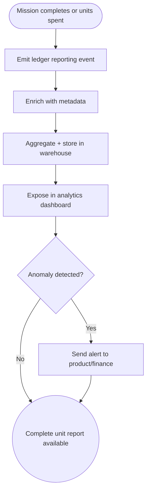

import FeatureSummary from '@site/src/components/FeatureSummary';

# Lumens Reporting

## Summary

<FeatureSummary />

## Narrative
Product and finance teams need a reliable view into how Lumens move through the ecosystem. Reporting ingests every earn and spend event, annotates it with metadata like location and surface, and rolls it into dashboards that reveal health trends.

The first iteration focuses on mission completion and spend behavior: how many units are generated, how quickly they are redeemed, and where value accumulates.

## Interaction
1. Whenever a mission completes or units are spent, the ledger emits a reporting event.
2. Data pipeline enriches the event with user, geo, device, and feature tags.
3. Warehouse jobs aggregate totals, net flow, and cohort behaviors at daily and weekly cadences.
4. Analytics dashboard exposes filters for capability, geography, and version to slice the data.
5. Product managers export CSV or connect BI tools for deeper analysis.
6. Alerts trigger when spending or earning deviates from expected ranges.
7. Data governance monitors pipelines for failures and reruns if needed.

:::caution Edge Case
If enrichment fails for a subset of events, quarantine them instead of polluting aggregates and notify analysts with remediation guidance.
:::

:::tip Signals of Success
- Teams answer “How are units flowing?” without manual scripts.
- Reports refresh on schedule and align with ledger totals.
- Alerts catch anomalies early so the economy can adjust quickly.
:::

## Journey

## Requirements
- **Acceptance criteria**
  - GIVEN a qualifying event occurs WHEN pipelines run THEN the dashboard reflects it within the defined reporting window.
  - GIVEN an event cannot be enriched WHEN processing THEN it is flagged and retried without entering aggregates.
  - GIVEN a metric breaches thresholds WHEN alerting fires THEN stakeholders receive context with next steps.
- **No-gos & risks**
  - Letting reporting diverge from the ledger undermines confidence in the economy.
  - Missing governance could expose sensitive user data; adhere to privacy policies.
  - Dashboards without context or definitions can be misinterpreted.

## Data
- **Primary metric:** Reporting freshness (event-to-dashboard latency).
- **Secondary checks:** Enrichment success rate, alert accuracy, analyst satisfaction, and export volume.
- **Telemetry requirements:** Log pipeline durations, error counts, quarantine volume, alert triggers, and dashboard query performance.

## Open Questions
- Do we support real-time streaming views or stick to daily batches for 0.4?
- Which teams need customized exports beyond the default dashboard?
