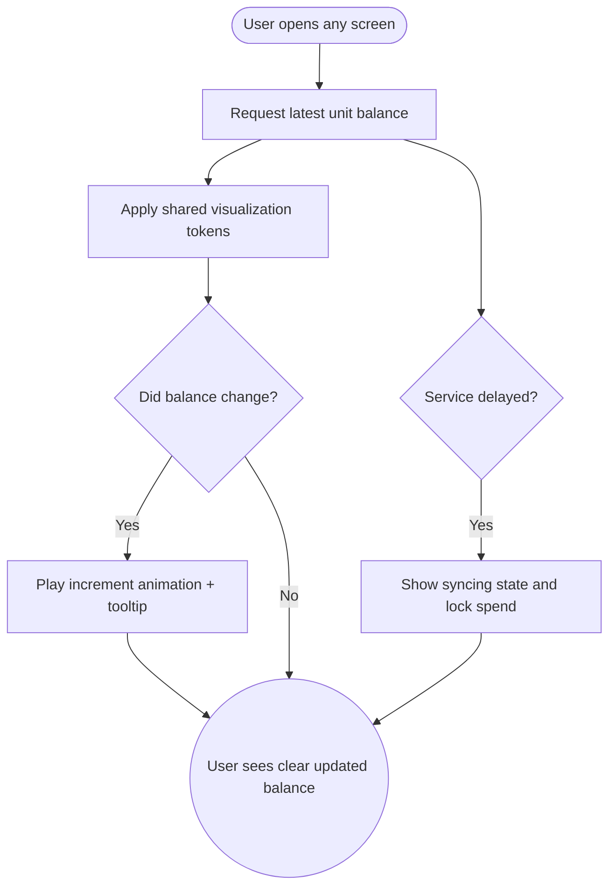

import FeatureSummary from '@site/src/components/FeatureSummary';

# Lumens Visualization

## Summary

<FeatureSummary />

## Narrative
Lumens become a first-class visual language throughout the app in 0.4. Profile chips, map overlays, practice confirmations, and notification banners now share the same design tokens, so the currency feels consistent wherever a user checks in.

The visualization emphasizes clarity: balances pulse subtly when they change, zero states explain how to earn, and contextual badges highlight whether units are available to spend or still pending confirmation. This reduces confusion about what the balance represents.

## Interaction
1. User navigates through onboarding, home, practice, or rewards screens, each requesting the latest balance.
2. Design system tokens format the balance with consistent typography, colors, and icons.
3. When new units arrive, micro-animations highlight the increment before settling into the static state.
4. Contextual tooltips explain how to earn or spend units based on the surface the user is on.
5. Dark/light mode, localization, and accessibility states apply without duplicating layouts.
6. Balance updates stream from a shared context so every surface stays in sync without flicker.
7. Screens with intensive visuals (map, pulse) degrade gracefully by showing a compact balance chip.

:::caution Edge Case
If the balance service delays beyond SLA, show the last confirmed amount with a "Syncing units" badge and disable spend CTAs until a fresh response arrives.
:::

:::tip Signals of Success
- Users identify their unit balance at a glance on any screen.
- Visual updates feel coherent across ecosystem surfaces, reducing redundant UI work.
- Support tickets about "missing units" decline because numbers match ledger updates.
:::

## Journey

## Requirements
- **Acceptance criteria**
  - GIVEN a user opens any supported screen WHEN the balance context updates THEN every instance of the unit visualization reflects the same value and timestamp.
  - GIVEN the balance increases WHEN the animation plays THEN motion duration respects accessibility settings and never exceeds the design spec.
  - GIVEN the service returns stale or missing data WHEN rendering THEN a syncing state appears and spend CTAs deactivate.
- **No-gos & risks**
  - Divergent styles per surface confuse users and dilute the brand.
  - Re-rendering entire screens for small balance changes can impact performance on lower-end devices.
  - Showing spend CTAs while the balance is uncertain may lead to overdrafts.

## Data
- **Primary metric:** Percentage of sessions where balances across surfaces stay in sync (no mismatched telemetry events).
- **Secondary checks:** Animation error rate, syncing fallback frequency, comprehension feedback, and accessibility overrides.
- **Telemetry requirements:** Log balance value, timestamp, surface ID, render duration, animation variant, and fallback banners shown.

## Open Questions
- Do we surface fractional units anywhere or always round to whole numbers in this release?
- Should localization adjust icons for markets with differing currency metaphors?
