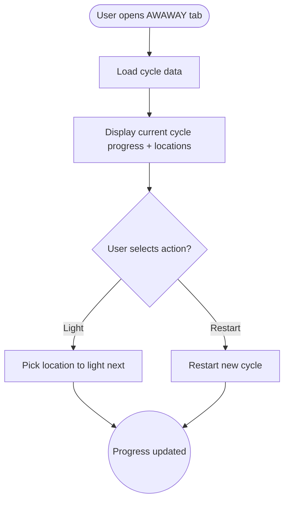

import FeatureSummary from '@site/src/components/FeatureSummary';

# Figures and Flow - Current Cycle Progress View

## Summary

<FeatureSummary />

## Narrative
Ignition extends AWAWAY beyond the first portal, visualizing entire cycles (up to ~48 weeks). The Current Cycle Progress View shows how many figures are collected, which locations can be lit next, and what happens after the cycle completes (restart with new geometry). Users can view Level 1 and Level 2 flows side by side and understand the code needed for merch unlocks.

## Interaction
1. AWAWAY tab loads the spiral with markers for each figure/portal.
2. Users toggle between “Current Cycle” and “Collected Figures.”
3. UI indicates 1/2 cycle completion status and highlights available locations to light on the globe.
4. Countdown timers show time remaining to keep the cycle alive.
5. When a cycle completes, CTA appears to restart or explore advanced flows.
6. Tooltips explain Field Key accumulation, cycle duration (~48 weeks), and merch tie-ins.
7. Data feeds the merch code feature when the final figure unlocks.

:::caution Edge Case
If data for older cycles is archived, show summarized stats rather than failing to load so users can still reminisce.
:::

:::tip Signals of Success
- Users clearly understand where they are within the long-form journey.
- Cycle restarts happen intentionally, not due to confusion.
- Visualizations remain responsive even with many figures.
:::

## Journey

## Requirements
- **Acceptance criteria**
  - GIVEN data is available WHEN the user opens the tab THEN cycle progress and figures render with accurate counts and visuals.
  - GIVEN the user completes a cycle WHEN the view updates THEN restart guidance appears along with any unlocks (e.g., merch code).
  - GIVEN older cycle data is archived WHEN requested THEN the view gracefully summarizes history instead of erroring.
- **No-gos & risks**
  - Overloading the UI with dense stats may overwhelm; keep flows intuitive.
  - Failing to clarify restart benefits could discourage long-term play.
  - Performance must be tuned; large 3D structures should stream progressively.

## Data
- **Primary metric:** Completion rate of full cycles.
- **Secondary checks:** Interaction rate with the cycle view, restart adoption, support tickets referencing confusion, and archived-cycle requests.
- **Telemetry requirements:** Log cycle ID, progress percentage, UI actions (toggle, restart), load times, errors, and archive/fallback usage.

## Open Questions
- Do we allow users to view upcoming cycles or keep them hidden until restart?
- Should the view include contextual tips (e.g., “3 days left to keep Cycle 1 alive”) via notifications?
