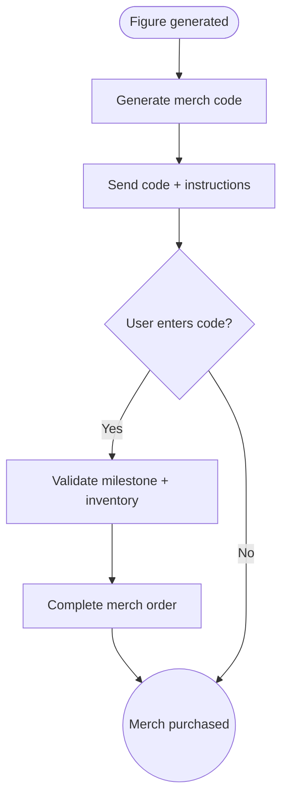

import FeatureSummary from '@site/src/components/FeatureSummary';

# Merch Code After Figure Generation

## Summary

<FeatureSummary />

## Narrative
Certain merch items (prints, apparel) should only be available to practitioners who’ve unlocked specific geometry. This feature issues a unique code immediately after a figure is generated, verifying eligibility at checkout. The code references the portal milestone and expires if not redeemed within a window, keeping perks exclusive.

## Interaction
1. AWAWAY service detects a new figure completion.
2. Merch entitlement service generates a unique code (or deep link) referencing the milestone.
3. User receives an in-app message/email with instructions and code.
4. In the merch store, entering the code unlocks the product and verifies authenticity.
5. Code usage updates the profile so users can’t reshare beyond allowed limits.
6. If the user restarts the cycle, a new code can issue for future merch drops.
7. Support tools allow reissuing codes if they expire before use (optional).

:::caution Edge Case
If merch inventory is depleted, acknowledge the achievement and offer to notify the user when stock returns rather than issuing a dud code.
:::

:::tip Signals of Success
- Only eligible users can purchase sacred-geometry merch.
- Codes are redeemed smoothly without manual checks.
- Limited drops maintain their mystique.
:::

## Journey

## Requirements
- **Acceptance criteria**
  - GIVEN a figure completes WHEN eligibility is confirmed THEN a code issues and is logged against the user with expiry metadata.
  - GIVEN the user redeems the code WHEN inventory is available THEN the merch store validates the milestone and processes checkout.
  - GIVEN a code expires or stock runs out WHEN user attempts redemption THEN we communicate status, log the attempt, and offer waitlist options.
- **No-gos & risks**
  - Codes must not be guessable or reusable by others; include signatures or tokenized links.
  - Inventory mismatches could leave users disappointed; sync with the merch backend frequently.
  - Avoid shipping codes in plaintext push notifications; use secure channels.

## Data
- **Primary metric:** Code redemption rate.
- **Secondary checks:** Invalid attempts, support tickets for missing codes, inventory constraints, and restock notifications sent.
- **Telemetry requirements:** Log figure ID, code ID, issue/expiry timestamps, redemption result, inventory status, and reissue actions.

## Open Questions
- Do we allow gifting codes or are they strictly personal?
- Should we bundle codes with digital certificates to reinforce authenticity?
