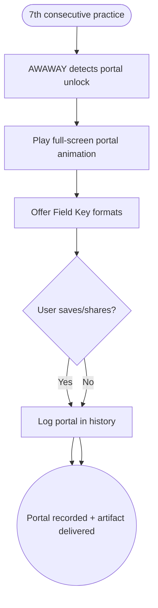

import FeatureSummary from '@site/src/components/FeatureSummary';

# First Portal (7 Practices)

## Summary

<FeatureSummary />

## Narrative
The first Light Portal is the user’s initial sacred milestone. After seven consecutive practices, we reveal a full-screen animation of the geometry coming alive, deliver a personalized Field Key, and explain how the artifact can be saved (email, mobile wallpaper, animated GIF) or activated in AR. Instructions accompany the celebration so users know how to use their new tool.

This ritual anchors AWAWAY’s value: commitment unlocks tangible, beautiful artifacts.

## Interaction
1. AWAWAY service detects seven consecutive practices and emits a portal-unlocked event.
2. Client preloads portal assets; when the user opens the app (or completes the seventh practice), play the animation full-screen.
3. Present the Field Key with personalization (name, date) and format selection (email, download, animated gif).
4. Provide instructions or meditative copy on how to work with the figure.
5. Log the portal in AWAWAY history and update the 3D spiral to highlight the completed node.
6. Offer sharing and printing options along with optional certificate delivery.
7. Store the artifact in the user’s gallery for future reference.

:::caution Edge Case
If connectivity drops during download, keep the portal celebration but delay asset delivery with a "We’re finalizing your Field Key" banner and automatically retrigger once online.
:::

:::tip Signals of Success
- Users complete seven-day streaks and receive their Field Keys without support intervention.
- Shared artifacts carry correct personalization and instructions.
- Portal celebrations feel special yet performant.
:::

## Journey

## Requirements
- **Acceptance criteria**
  - GIVEN a user completes seven consecutive practices WHEN the unlock occurs THEN the portal animation and Field Key selection appear the next time they open the app (or immediately if still in session).
  - GIVEN the user chooses a delivery format WHEN the request processes THEN the artifact includes personalization (name, date) and arrives without corruption.
  - GIVEN the celebration fails to download assets WHEN fallback triggers THEN the user receives a clear message and the system retries automatically.
- **No-gos & risks**
  - Missing personalization undermines the ritual; ensure data is ready before generating assets.
  - Replaying the celebration without explanation could cheapen the experience; provide manual replay in the gallery instead.
  - Heavy animations must include reduced-motion alternatives.

## Data
- **Primary metric:** Percentage of eligible users who successfully unlock and view the First Portal celebration.
- **Secondary checks:** Artifact delivery success rate, share/save rate, time-to-delivery after unlock, and fallback usage.
- **Telemetry requirements:** Log unlock timestamp, animation playback state, format chosen, delivery confirmations, retries, and fallback banners.

## Open Questions
- Do we allow replays of the animation from the gallery in 0.5?
- Should Field Keys expire or remain permanently accessible?
