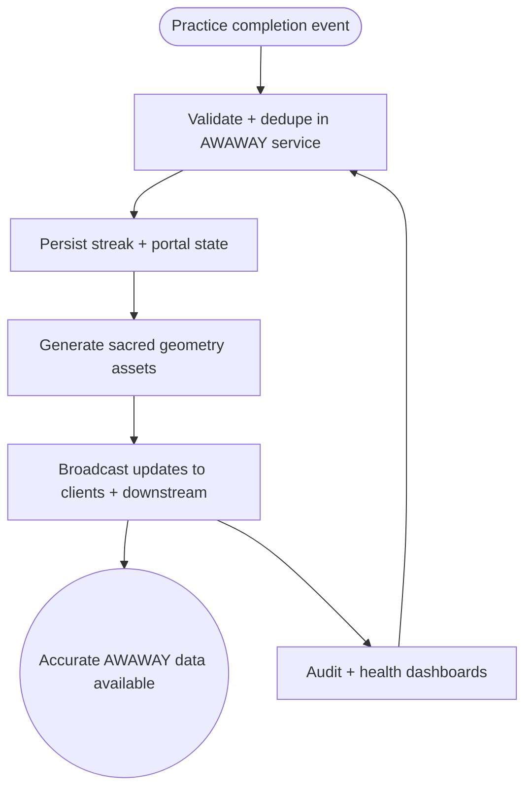

import FeatureSummary from '@site/src/components/FeatureSummary';

# AWAWAY Infrastructure

## Summary

<FeatureSummary />

## Narrative
Glow introduces sacred-geometry streaks, which demand resilient infrastructure before any UI renders. The AWAWAY Infrastructure feature defines the services, storage, and event flows that capture daily practice completions, calculate geometry progression, and expose that data to onboarding, reminders, rewards, and profile surfaces.

It handles idempotent event ingestion, streak calculations, portal unlock logic, asset generation, and API contracts so product teams can focus on storytelling while trusting the backend to stay accurate.

## Interaction
1. Client posts practice completion events with timestamps and context.
2. AWAWAY service validates the session, deduplicates, and writes streak records with portal progression metadata.
3. Sacred geometry generator creates or updates the current figure and stores references to render assets.
4. Aggregated progress (days in cycle, portals unlocked, pending Field Keys) is cached for low-latency reads across the app.
5. Downstream services (notifications, rewards, profile) subscribe to event streams to trigger reminders or unlocks.
6. Admin tools surface health metrics and allow safe replays if data corruption occurs.
7. Audit logs capture every change, including manual adjustments, for compliance and support.

:::caution Edge Case
If duplicate practice events arrive (e.g., offline replay), compare hashes/timestamps to avoid double-counting and emit a reconciliation alert instead.
:::

:::tip Signals of Success
- Streak data stays consistent across devices even when users switch connectivity states.
- Portal unlock events trigger exactly once per milestone.
- Downstream consumers ingest the same geometry assets without schema drift.
:::

## Journey

## Requirements
- **Acceptance criteria**
  - GIVEN a valid practice completion WHEN ingested THEN the streak count and geometry snapshot update once and become available to all APIs within the SLA.
  - GIVEN downstream services subscribe to AWAWAY events WHEN a portal unlocks THEN they receive the payload with sufficient metadata to personalize messaging.
  - GIVEN infrastructure detects data corruption or replay needs WHEN an operator triggers a rebuild THEN historical streaks can be recalculated without user-facing downtime.
- **No-gos & risks**
  - Storing streak logic solely on-device risks data loss and cheating.
  - Missing audit trails makes support unable to debug geometry issues.
  - Mixing AWAWAY data with unrelated ledgers complicates compliance; keep boundaries clear.

## Data
- **Primary metric:** Percentage of AWAWAY events processed successfully within target latency.
- **Secondary checks:** Duplicate event rate, rebuild frequency, cache hit ratio, and reconciliation alerts.
- **Telemetry requirements:** Log ingestion timestamps, dedupe outcomes, portal unlock IDs, asset generation time, downstream delivery status, and replay triggers.

## Open Questions
- Do we snapshot geometry assets per day or only per portal unlock?
- What is the SLA for recomputing streaks when users request historical corrections?
