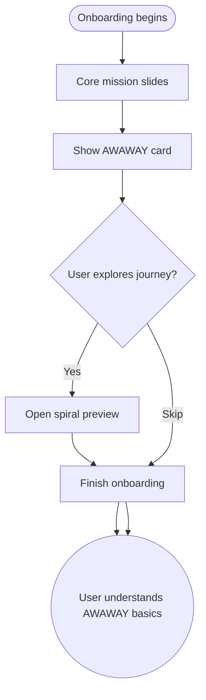

import FeatureSummary from '@site/src/components/FeatureSummary';

# Add AWAWAY to Onboarding Experience

## Summary

<FeatureSummary />

## Narrative
Glow needs to seed the AWAWAY mythos before users start practicing. This onboarding card explains what streak geometry is, why it matters, and how daily practice builds toward portals and Field Keys. Tone stays inspirational—"You are building something luminous and eternal"—while remaining concrete about the next steps.

We reuse the actual AWAWAY visuals so the card feels consistent with the in-app tab. Optional CTAs let curious users preview the spiral journey or skip if they want to learn later.

## Interaction
1. Onboarding flow inserts the AWAWAY card after core mission/values slides.
2. Card shows the spiral progression, countdown to first Light Portal, and copy explaining Field Keys.
3. Users can tap "See the journey" to expand the 3D preview or "Skip for now" to continue.
4. Completion of the card records a flag so reminders later know whether the concept was seen.
5. If the user re-enters onboarding (e.g., reinstall), we resume at the AWAWAY card to avoid repetition.
6. Tooltips offer localized copy describing how streaks unlock geometry and missions.
7. Analytics capture impressions, tap-through, and skip rates to refine messaging.
- **Edge case:** When devices cannot render the 3D preview, we swap to static imagery while keeping the same narrative.
- **Signals of success**
  - Users recall what AWAWAY means when they encounter it later in the product.
  - Skip rate remains low because the card feels aspirational and relevant.
  - Support tickets asking “What is AWAWAY?” decrease for new cohorts.

## Journey

## Requirements
- **Acceptance criteria**
  - GIVEN a new user enters onboarding WHEN the AWAWAY card appears THEN it displays localization-ready copy, spiral imagery, and CTA buttons.
  - GIVEN the user taps "See the journey" WHEN the preview opens THEN returning to onboarding resumes at the same step without restarting.
  - GIVEN the user skips the card WHEN onboarding completes THEN analytics note the skip so future nudges can adapt.
- **No-gos & risks**
  - Overloading onboarding with jargon could cause drop-off; keep copy inspiring and simple.
  - Rendering-heavy assets on low-end devices may stutter; always provide a static fallback.
  - Forgetting accessibility descriptions would exclude screen-reader users.

## Data
- **Primary metric:** Completion rate for the AWAWAY onboarding card.
- **Secondary checks:** Preview tap rate, skip frequency, streak activation correlation, and fallback usage.
- **Telemetry requirements:** Log slide impressions, CTA taps, fallback type, resume points, and locale.

## Open Questions
- Should we personalize the card for returning users versus brand-new ones?
- Do we promise specific rewards (Field Keys, merch codes) during onboarding or keep it high-level?
