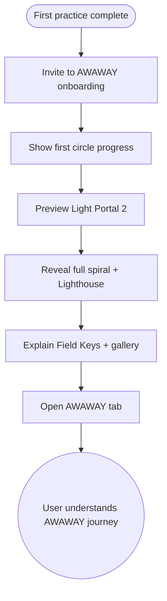

import FeatureSummary from '@site/src/components/FeatureSummary';

# AWAWAY Onboarding Flow

## Summary

<FeatureSummary />

## Narrative
Once a user completes their first practice, we open the AWAWAY onboarding sequence—a guided tour through the spiral journey. It starts with the first circle (“days in practice”), previews the Light Portal ladder, shows the dual-flow map, and teases the ultimate Lighthouse. Copy grounds the mystical visuals: “Each step amplifies your field of light.”

The flow also introduces Field Keys—digital artifacts unlocked per portal that users can save as wallpapers, print, or activate via AR. Saved state ensures users can pause and resume without losing context.

## Interaction
1. After the first completed practice, prompt the user to explore AWAWAY onboarding.
2. Flow loads a persistent state machine (`[AWA-onboarding] Base`) that tracks visited steps.
3. Slide 1: show current circle with day count and message “5 steps to first Light Portal.”
4. Slide 2: preview second circle and Dual Flow (Light Portal 2).
5. Slide 3: render the entire spiral to the Lighthouse plus the Field Key gallery.
6. Slide 4: introduce tools of light (Field Keys) and how to save/share them.
7. Finish with a recap and CTA to open the AWAWAY tab; data sync ensures onboarding won’t replay unless requested.

:::caution Edge Case
If the app closes mid-flow, persist the slide index locally so users resume where they stopped without duplicate content.
:::

:::tip Signals of Success
- Users complete the flow and immediately open the AWAWAY tab.
- Field Key saves increase because expectations were set early.
- Support questions about “spiral meaning” decline.
:::

## Journey

## Requirements
- **Acceptance criteria**
  - GIVEN a user unlocks AWAWAY onboarding WHEN the flow starts THEN state persists locally so re-entry resumes at the last slide.
  - GIVEN the user finishes the flow WHEN they tap the CTA THEN the AWAWAY tab opens with real data.
  - GIVEN localization is required WHEN the flow renders THEN captions, narration, and Field Key descriptions respect locale settings.
- **No-gos & risks**
  - Resetting onboarding on every launch will annoy users; respect completion flags.
  - Heavy assets without loading states could make the flow feel broken.
  - Avoid over-promising future rewards (certificates, merch) until ready.

## Data
- **Primary metric:** Completion rate of the AWAWAY onboarding flow.
- **Secondary checks:** Time per slide, Field Key save rate post-onboarding, re-open rate of the AWAWAY tab, and resume frequency.
- **Telemetry requirements:** Log slide impressions, exit reasons, resume events, CTA taps, and completion timestamps.

## Open Questions
- Do we include audio narration in 0.5 or keep it text-and-visual only?
- Should Field Key previews be interactive (e.g., AR teaser) or static for this version?
