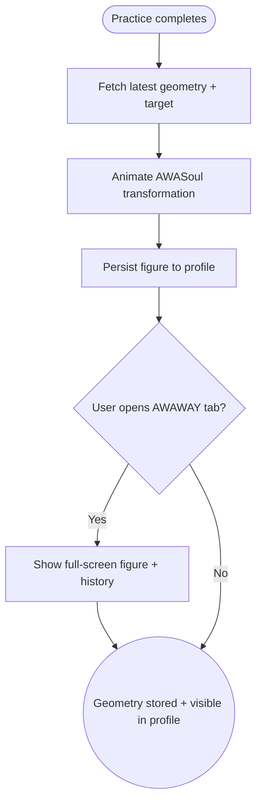

import FeatureSummary from '@site/src/components/FeatureSummary';

# AWAWAY Visualization

## Summary

<FeatureSummary />

## Narrative
Each completed practice evolves the AWASoul avatar into geometric forms, illustrating streak growth as something beautiful rather than a raw counter. Glow introduces real-time transformations on completion screens and persistent geometry stored inside the profile so users can revisit their progress anytime.

The visualization has to stay coherent across 2D cards, 3D spirals, and map overlays, reflecting both the current portal and cumulative history. Subtle animations connect the before-and-after state, reinforcing that every practice adds another layer to the geometry.

## Interaction
1. Upon practice completion, the client fetches the latest geometry state plus the upcoming target from AWAWAY services.
2. Completion screen animates AWASoul morphing into the new segment, highlighting how many days remain until the next portal.
3. Profile and AWAWAY tabs render the same geometry using lightweight assets, showing streak age, current figure, and saved Field Keys.
4. Users can tap the figure to expand full-screen, view guided copy, or share the image.
5. Stored figures persist in the streak history so users can revisit earlier portals.
6. Low-power mode swaps heavy 3D assets for simplified outlines without losing context.
7. Accessibility descriptions narrate the transformation for screen readers.

:::caution Edge Case
If geometry assets fail to download, show the last cached figure with a “Syncing AWAWAY visuals” badge and retry quietly in the background.
:::

:::tip Signals of Success
- Users immediately associate practice completion with visible geometry changes.
- Shared visuals remain consistent across surfaces, reducing confusion.
- Render performance stays within budget even on older devices.
:::

## Journey

## Requirements
- **Acceptance criteria**
  - GIVEN a practice completion WHEN the animation plays THEN AWASoul morphs into the correct geometry segment and shows days remaining.
  - GIVEN the user opens their profile WHEN AWAWAY renders THEN it loads cached assets first and refreshes if newer versions exist.
  - GIVEN an asset download fails WHEN retrying THEN the UI communicates the fallback without flickering or losing prior figures.
- **No-gos & risks**
  - Divergent visuals between completion and profile erode trust.
  - Overly heavy 3D assets could drain battery and cause churn.
  - Lack of accessible descriptions excludes users relying on screen readers.

## Data
- **Primary metric:** Render success rate for AWAWAY visuals across devices.
- **Secondary checks:** Animation latency, share rate of geometry snapshots, fallback frequency, and support tickets referencing missing figures.
- **Telemetry requirements:** Log asset version, render duration, animation completion, fallback banners, share actions, and low-power substitutions.

## Open Questions
- Do we allow users to switch between multiple visual styles (wireframe vs. filled) in 0.5?
- Should geometry snapshots include timestamps or captions when shared externally?
