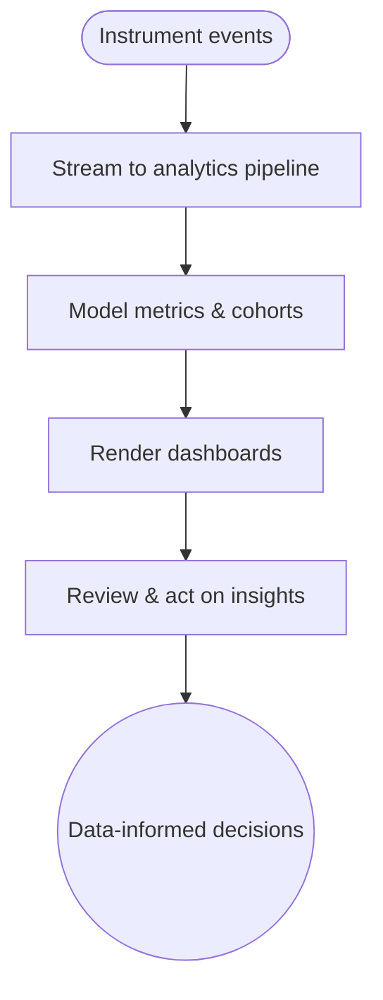

import FeatureSummary from '@site/src/components/FeatureSummary';

# Basic Analytics (Engagement & Retention)

## One-Glance Summary

<FeatureSummary />

## Narrative
Basic Analytics provides the initial visibility into AWATERRA’s health. Dashboards surface end-to-end funnels: installs, onboarding completions, practice starts, and repeat engagement. Accurate instrumentation informs roadmap decisions, marketing, and operations without waiting on manual exports.

## Interaction Blueprint
1. Instrument key events across app (install, onboarding step, practice start/finish, notification opens).
2. Stream events into the analytics warehouse with consistent schemas and versioning.
3. Build dashboards displaying KPIs, cohort retention, and pulse-related engagement.
4. Define scheduled refresh cadence and data QA checks.
5. Share access with stakeholders and document metric definitions to avoid misinterpretation.
6. Iterate on instrumentation based on gaps identified in reviews.

- Edge case: Event schema changes break dashboards; use versioning and backward-compatible updates.

- Signals of success:
  - Stakeholders rely on dashboards for weekly reviews without questioning accuracy.
  - Instrumentation covers all critical journeys with minimal sampling gaps.
  - Data anomalies are detected quickly thanks to automated QA.

### Mermaid Journey IN MERMAID FORMAT

## Requirements & Guardrails
- **Acceptance criteria**
  - GIVEN an event fires WHEN it reaches analytics THEN metadata (user id, locale, version) is populated correctly.
  - GIVEN dashboards WHEN refreshed THEN metrics align within tolerance to backend truth where applicable.
  - GIVEN new questions arise WHEN instrumentation is missing THEN backlog captures work with priority tagging.
- **No-gos & risks**
  - Tracking personal data without anonymization or consent alignment.
  - Overcomplicating dashboards with vanity metrics.
  - Allowing long refresh delays that render insights stale.

## Data & Measurement
- Primary metric: Dashboard freshness within defined SLA (e.g., updated every hour/day).
- Secondary checks: Event delivery success rate, schema validation errors, stakeholder satisfaction surveys.
- Telemetry requirements: Log pipeline health, transformation job success, and dashboard access metrics.

## Open Questions
- Which analytics stack (e.g., Segment + BigQuery + Looker) do we standardize on for v0.1?
- How do we incorporate qualitative feedback alongside quantitative metrics in future iterations?
