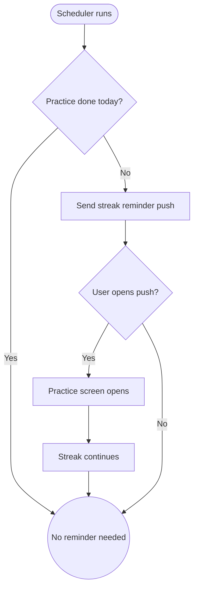

import FeatureSummary from '@site/src/components/FeatureSummary';

# Daily Streak Reminder

## Summary

<FeatureSummary />

## Narrative
AWAWAY depends on gentle but timely nudges. The Daily Streak Reminder keeps practitioners aware of their progress, signaling when today’s practice is still pending or the streak is hours from resetting. Copy remains calm: “5 steps to your next Light Portal” rather than fear-based countdowns.

Reminders respect user-selected cadence, timezone, and do-not-disturb windows, so paid users feel supported rather than spammed.

## Interaction
1. Scheduler checks each user’s AWAWAY state and preferred reminder time.
2. If no practice logged for the day (or streak near break), generate push with streak count, portal progress, and CTA.
3. Push deep-links to the Practice screen with the relevant card preselected.
4. If the user practices, the reminder is marked complete; otherwise a follow-up summary appears before reset.
5. Snooze/dismiss actions update personalization to avoid repeating unhelpful times.
6. Reminder history is visible in notification center for transparency.
7. Analytics capture delivery, engagement, and observed streak saves.

:::caution Edge Case
If portal progression already advanced (e.g., user practiced offline), auto-cancel the reminder and log the skipped send so we do not nag users unnecessarily.
:::

:::tip Signals of Success
- Users complete their practice shortly after receiving the reminder.
- Reminder opt-out rate stays low.
- Streak breakage declines among cohorts receiving the feature.
:::

## Journey

## Requirements
- **Acceptance criteria**
  - GIVEN a user opts into reminders WHEN they have not practiced by their reminder time THEN a push arrives with streak count, portal progress, and CTA.
  - GIVEN the user taps the push WHEN the app opens THEN they land on the Practice view focused on keeping the streak alive.
  - GIVEN the user snoozes or disables reminders WHEN stored THEN future scheduling respects their preference immediately.
- **No-gos & risks**
  - Sending reminders after a user has already practiced feels careless; always re-check state before dispatch.
  - Aggressive wording may create anxiety; maintain AWATERRA’s supportive tone.
  - Not respecting quiet hours risks churn and app uninstalls.

## Data
- **Primary metric:** Streak continuation rate among users receiving reminders.
- **Secondary checks:** Push delivery success, tap-through rate, snooze/opt-out rate, and correlation with portal unlock speed.
- **Telemetry requirements:** Log reminder type, scheduled/send time, cancel reason, tap events, snooze actions, and resulting practice timestamp.

## Open Questions
- Do we allow users to configure multiple reminder windows or keep it single-slot in 0.5?
- Should reminders mention Field Key rewards or keep copy focused on today’s action?
