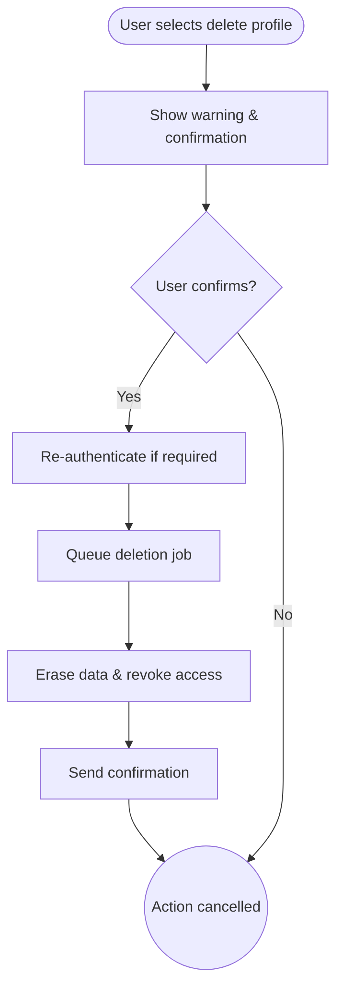

import FeatureSummary from '@site/src/components/FeatureSummary';

# Delete Profile

## One-Glance Summary

<FeatureSummary />

## Narrative
Delete Profile honors user agency. The flow shares clear warnings about data loss, requests deliberate confirmation, and then erases data across primary and backup systems.

Tone stays compassionate, thanking the user for their time while staying aligned with privacy standards.

## Interaction Blueprint
1. Expose Delete Profile within Application Settings with brief explanation and link to data policy.
2. When selected, show a modal summarizing consequences (loss of AWAunits, history, social features).
3. Require explicit confirmation (e.g., typing DELETE or re-authentication) to proceed.
4. Queue deletion job that revokes tokens, scrubs personal data, and triggers required downstream processes.
5. Notify the user via in-app message and email once deletion is complete.
6. Log the action for compliance audits without retaining personal data.

:::caution Edge Case
User requests deletion but reconsiders within a short grace period. Offer a brief cancellation window before the hard delete completes.
:::

:::tip Signals of Success
- Deletion requests finish within the promised timeframe across all systems.
- Users receive confirmation and do not find leftover data after return.
- Support sees minimal follow-up about partial deletions or lingering notifications.
:::

### Journey

## Requirements & Guardrails
- **Acceptance criteria**
  - GIVEN a user initiates deletion WHEN confirmation is provided THEN all sessions terminate immediately.
  - GIVEN the deletion job runs WHEN complete THEN associated telemetry, content, and personal identifiers are purged per policy.
  - GIVEN legal obligations (e.g., payment records) WHEN retention is required THEN data is anonymized and documented.
- **No-gos & risks**
  - Deleting without clear warning or secondary confirmation.
  - Leaving orphaned records that could resurface the user’s presence.
  - Failing to comply with regional regulations around proof of deletion.

## Data & Measurement
- Primary metric: Deletion request completion time vs. SLA.
- Secondary checks: Number of cancellations during the grace period, support tickets related to deletion, and audit pass rate.
- Telemetry requirements: Log initiation, confirmation time, job status, and completion notifications.

## Open Questions
- Should we offer data export within the deletion flow or direct users to GDPR request first?
- What grace period balances user control with backend efficiency (e.g., 7 days vs. immediate)?
