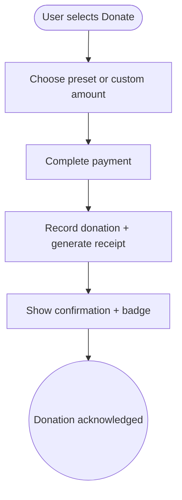

import FeatureSummary from '@site/src/components/FeatureSummary';

# Donation (Paid)

## Summary

<FeatureSummary />

## Narrative
Beyond subscriptions and unit spending, some members simply want to donate money. The Donation feature offers a straightforward, trustworthy flow—select an amount, confirm payment, receive a receipt—without gamification. Copy ties donations to tangible outcomes (supporting masters, funding preservation) so users understand impact.

The flow reuses subscription billing rails where possible but keeps donations separate for accounting and tax receipts.

## Interaction
1. Paid user taps “Donate” from profile, mission pages, or upsell modals.
2. UI presents preset amounts plus a custom field, along with impact statements and legal disclaimers.
3. User confirms payment via platform billing or web checkout.
4. Backend records the donation, issues receipt/invoice, and updates thank-you badges in profile.
5. Confirmation screen offers shareable copy and saveable documents.
6. Donation history is accessible from profile for reference.
7. Refund/issue flows route to support with donation IDs.

:::caution Edge Case
If the transaction completes but receipt generation fails, surface “Donation received—receipt on the way” and queue an email once the service recovers.
:::

:::tip Signals of Success
- Donations process without confusion or double charges.
- Receipts meet regulatory requirements for each region.
- Users feel emotionally connected to the cause.
:::

## Journey

## Requirements
- **Acceptance criteria**
  - GIVEN a user confirms a donation WHEN payment succeeds THEN receipts (email/in-app) deliver with donation ID and amount.
  - GIVEN a donation fails WHEN billing declines THEN the UI explains the failure and allows retry without duplicate charges.
  - GIVEN regulatory requirements differ by region WHEN the donation screen loads THEN tax/legal copy adapts accordingly.
- **No-gos & risks**
  - Mixing donations with subscription entitlements blurs accounting; keep ledgers separate.
  - Vague messaging on fund usage may reduce trust.
  - Failing to provide receipts could create legal exposure.

## Data
- **Primary metric:** Total donation volume per month.
- **Secondary checks:** Average donation size, receipt delivery success, refund rate, and fallback rate for delayed receipts.
- **Telemetry requirements:** Log donation ID, amount, currency, payment outcome, receipt status, donor locale, and share actions.

## Open Questions
- Do we offer recurring donations or only one-time gifts in 1.0?
- Should donors choose specific initiatives (masters, missions) or contribute to a general fund?
