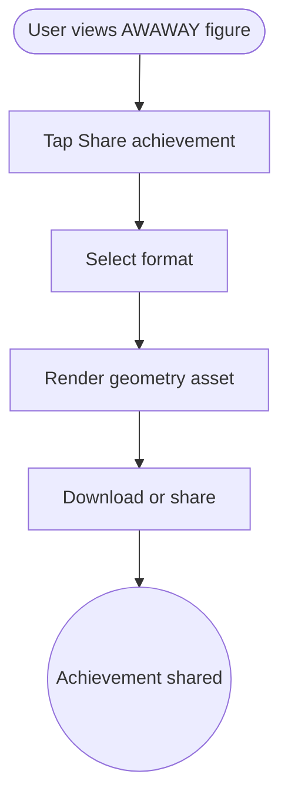

import FeatureSummary from '@site/src/components/FeatureSummary';

# Download & Share Geometry Status as Achievement (Paid)

## Summary

<FeatureSummary />

## Narrative
After investing weeks in AWAWAY streaks, members should memorialize their geometry. This feature lets them capture the current spiral, portal, or Field Key as a high-resolution image or AR-ready asset complete with captions. It differs from the general dashboard export by focusing specifically on the sacred geometry.

## Interaction
1. User opens AWAWAY tab and taps “Share achievement.”
2. Choose between formats: square image, wallpaper, AR marker, or printable certificate.
3. Service renders the geometry with the user’s name, portal number, and date.
4. Asset downloads or opens share sheet with suggested copy.
5. Optionally attach a short audio mantra or description.
6. Saved assets appear in the Field Key gallery for later use.
7. If the user earns a new geometry, we prompt them to share immediately.

:::caution Edge Case
When the geometry is mid-render (e.g., unlocking portal), disable sharing until data finalizes to avoid half-finished shapes.
:::

:::tip Signals of Success
- Members proudly share their AWAWAY milestones.
- Assets remain accurate and aesthetically aligned with AWATERRA’s brand.
- Gallery storage stays manageable with versioning.
:::

## Journey

## Requirements
- **Acceptance criteria**
  - GIVEN a user taps Share WHEN their geometry is stable THEN they can pick a format and receive an asset within target latency.
  - GIVEN the user opts to include their name WHEN rendering THEN the asset shows correct spelling and localization; if they opt out, we omit personal identifiers.
  - GIVEN an asset is shared externally WHEN the link is followed THEN recipients see a clean preview (OpenGraph/OG tags) referencing AWATERRA.
- **No-gos & risks**
  - Sharing incomplete or incorrect geometry undermines the ritual; wait for confirmed states.
  - Large AR files may exceed device limits; stream or compress responsibly.
  - Avoid watermarks that feel commercial; keep the tone ceremonial.

## Data
- **Primary metric:** Geometry achievement shares per AWAWAY milestone.
- **Secondary checks:** Render time, file size, AR usage, gallery storage growth, and fallback usage.
- **Telemetry requirements:** Log portal ID, format chosen, render status, share destination, errors, and archive cleanup events.

## Open Questions
- Do we provide templates for printed certificates or rely on Field Keys alone?
- Should assets include QR codes that verify authenticity or link to AWAWAY progress?
