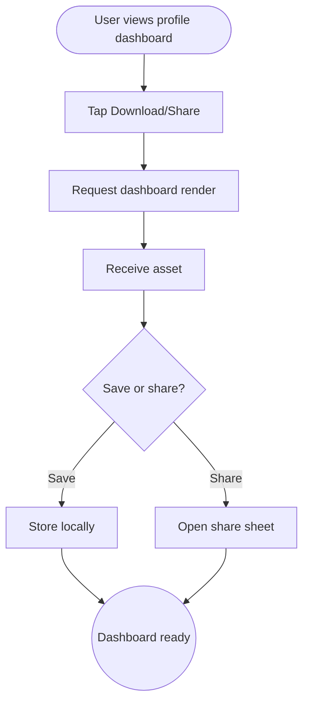

import FeatureSummary from '@site/src/components/FeatureSummary';

# Download Shareable Dashboard (Paid)

## Summary

<FeatureSummary />

## Narrative
Ignition’s paid members gain access to a full-profile dashboard with practice counts, reactions, AWAWAY progress, and missions supported. This feature lets them export that snapshot as a branded image/PDF they can keep, print, or share on social. It’s the digital certificate of their journey.

Exports must capture current data, respect privacy (no emails), and render in multiple aspect ratios for phones, tablets, and print. Users can trigger downloads directly or use system share sheets.

## Interaction
1. User opens the profile dashboard (see “User Profile and Dashboard v1”).
2. They tap “Download” or “Share” from the dashboard header.
3. Client requests a render job from the export service with current metrics and avatar/geometry art.
4. Service returns a high-resolution asset plus metadata (caption suggestions, hashtags).
5. UI saves the file to device storage and/or opens the share sheet.
6. Confirmation toast indicates where the file lives; recently exported dashboards list for quick reuse.
7. If the user revokes paid status, the download option hides until resubscription.

:::caution Edge Case
If rendering takes too long, show progress and allow background processing, notifying the user once the file is ready rather than blocking the UI.
:::

:::tip Signals of Success
- Exports accurately mirror in-app stats with no stale data.
- Shared dashboards look premium and drive organic interest.
- Render failures remain rare and self-heal.
:::

## Journey

## Requirements
- **Acceptance criteria**
  - GIVEN a user taps Download WHEN the render completes THEN the asset saves in the user’s gallery/files with confirmation.
  - GIVEN they select Share WHEN assets return THEN the native share sheet opens with prefilled copy and the rendered file attached.
  - GIVEN rendering fails WHEN the timeout hits THEN the user gets a gentle error, no charges occur, and they can retry without duplicate exports.
- **No-gos & risks**
  - Embedding personal identifiers (email, full name) may create privacy issues; stick to display names and achievements.
  - Heavy files could clog storage; provide size estimates and clean-up hints.
  - Without caching, hitting the service repeatedly may cause rate limits—add cooldowns.

## Data
- **Primary metric:** Number of dashboard exports per paid member.
- **Secondary checks:** Render success rate, average render time, share destinations, cancellations, and background-mode usage.
- **Telemetry requirements:** Log dashboard version, metrics snapshot timestamp, render duration, save/share outcome, asset size, and fallback/error reasons.

## Open Questions
- Do we allow users to customize which metrics appear before exporting?
- Should exports include QR codes linking to referral or verification pages?
