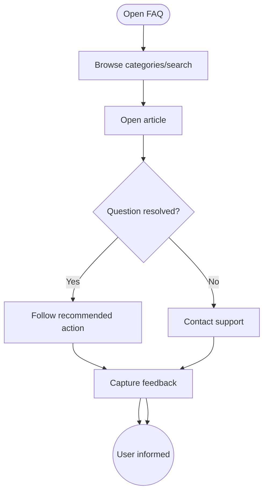

import FeatureSummary from '@site/src/components/FeatureSummary';

# FAQ

## One-Glance Summary

<FeatureSummary />

## Narrative
The FAQ is a self-serve knowledge base inside AWATERRA. It answers common questions about practices, rewards, privacy, and troubleshooting so users can help themselves before contacting support.

Content stays concise, compassionate, and easy for non-engineers to update, which keeps the brand voice consistent.

## Interaction Blueprint
1. Provide a discoverable FAQ entry point from Profile and key empty states.
2. Organize content into mindful categories (Practices, Rewards, Account, Data, Technical).
3. Enable search and quick links so users reach answers within two taps.
4. Support inline actions (e.g., open settings) for questions with clear follow-up steps.
5. Track deflection metrics by capturing whether the answer resolved the question.
6. Establish a content governance process for adding, editing, and retiring articles.

:::caution Edge Case
A question lacks an article. Present contact support options with prefilled context.
:::

:::tip Signals of Success
- Most questions resolve without escalation to human support.
- FAQ articles stay aligned with current product capabilities and policies.
- Content creators outside engineering can update entries quickly.
:::

### Journey

## Requirements & Guardrails
- **Acceptance criteria**
  - GIVEN a new article WHEN published THEN it appears immediately across clients with proper formatting.
  - GIVEN a user searches WHEN keywords match THEN relevant articles rank at the top.
  - GIVEN a user still needs help WHEN they tap Contact Support THEN context is prefilled to reduce effort.
- **No-gos & risks**
  - Stale or contradictory answers that erode trust.
  - Overly technical language inconsistent with the AWATERRA tone.
  - Requiring engineers for day-to-day content updates.

## Data & Measurement
- Primary metric: FAQ self-resolution rate (users marking answers helpful / not opening support ticket afterward).
- Secondary checks: Search term coverage, article freshness SLA, and feedback sentiment.
- Telemetry requirements: Log views, search queries, helpfulness votes, and escalations.

## Open Questions
- Should we integrate FAQ analytics with support tooling for automated article suggestions?
- Do we need localization for FAQ in v0.1 or can it follow language rollout?
