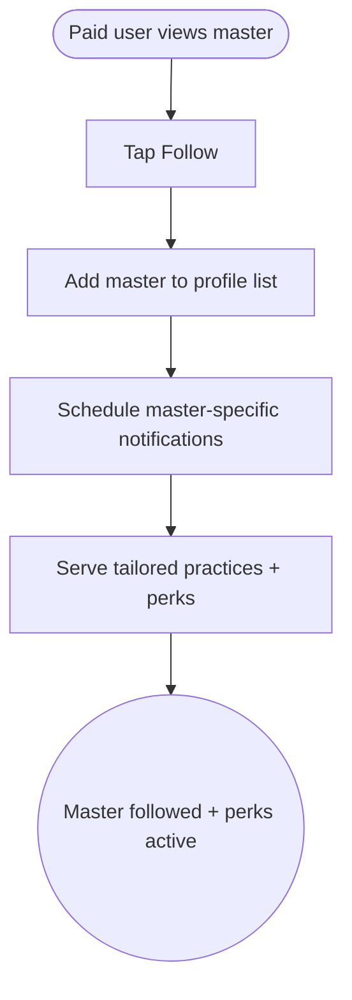

import FeatureSummary from '@site/src/components/FeatureSummary';

# Users Can Follow Masters (Paid)

## Summary

<FeatureSummary />

## Narrative
Paid members can cultivate deeper relationships with masters by following them. Following adds the master to the profile, delivers notifications about new practices, surfaces history, and unlocks perks: daily recommended practice, 1.5x participation multiplier, priority spots in collectives, monthly personal messages, and certificates of study.

The experience must feel intimate and respectful—following is a commitment, not a casual “like.”

## Interaction
1. Paid user visits a master profile and taps “Follow.”
2. Master appears in the user’s Saved Masters list on profile.
3. Notifications are scheduled for upcoming practices, exclusive drops, and monthly personal messages.
4. Practice recommendations adapt to highlight followed masters with 1.5x rewards where applicable.
5. Users can view their interaction history (sessions joined, notes, saved practices) within the master’s card.
6. Priority handling ensures they get early access to collective practice slots.
7. Certificates or acknowledgements distribute periodically for long-term students.

:::caution Edge Case
If a user cancels subscription, the Follow list stays visible but becomes read-only until they renew; notifications pause automatically.
:::

:::tip Signals of Success
- Paid users follow masters and engage with their content more often than non-followers.
- Master dashboards show accurate follower counts and retention.
- Exclusive perks (priority, messages) deliver without manual work.
:::

## Journey

## Requirements
- **Acceptance criteria**
  - GIVEN a paid user follows a master WHEN they return to profile THEN the master appears with next practice info and quick actions.
  - GIVEN the master schedules a new practice WHEN the follower list updates THEN paid followers receive notifications before the general audience (within defined rules).
  - GIVEN a user unfollows a master WHEN action confirms THEN notifications stop and the master is removed from the list immediately.
- **No-gos & risks**
  - Allowing free users to follow undermines subscription value; enforce gating.
  - Over-notifying followers dilutes the premium feel; respect cadence.
  - Priority slots must not block fairness; define caps and transparency.

## Data
- **Primary metric:** Percentage of paid users following at least one master.
- **Secondary checks:** Average masters followed, session attendance uplift, churn differences for followers vs non-followers, and read-only state entries.
- **Telemetry requirements:** Log follow/unfollow events, notification sends, priority slot assignments, perk delivery statuses, and subscription status when follow state changes.

## Open Questions
- Do we allow users to favorite masters beyond following (e.g., star for monthly message focus)?
- How do masters manage their follower perks (message templates, certificate issuance)?
