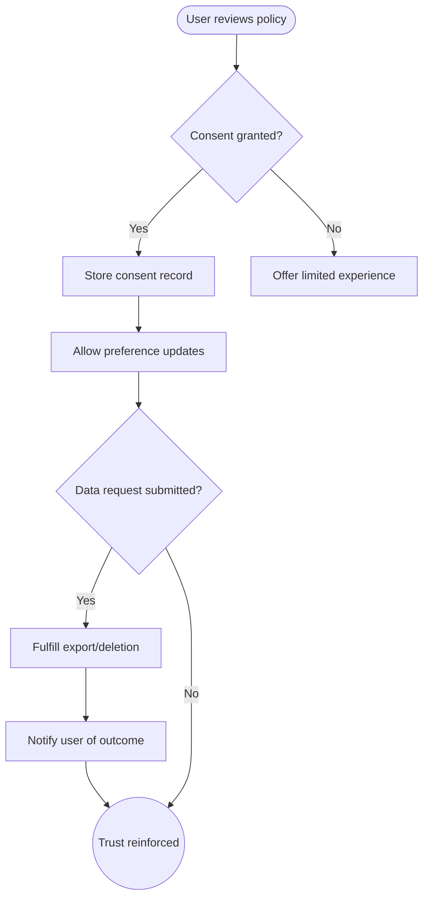

import FeatureSummary from '@site/src/components/FeatureSummary';

# GDPR Compliance

## Summary

<FeatureSummary />

## Narrative
GDPR Compliance turns AWATERRA’s mindful data promise into daily practice. Users need clear explanations of what we collect, why, and how to control it across consent flows, settings, and backend tools.

Transparent copy and resilient storage reduce legal risk while strengthening trust. The system should feel empowering, not bureaucratic.

## Interaction
1. Present clear consent choices during signup with granular toggles for communications and data processing.
2. Store consent artifacts with timestamps, policy versions, and geo metadata for audit trails.
3. Expose settings to review and modify preferences later, including notification categories and language.
4. Provide self-service flows to request data exports or deletion, escalating to operations when manual handling is required.
5. Confirm actions via email or in-app receipts so users know their request is acknowledged.
6. Coordinate backend jobs to fulfill access/deletion within regulatory timelines and log completion.

:::caution Edge Case
A user withdraws consent while active sessions exist. Revoke tokens and mask data gracefully.
:::

:::tip Signals of Success
- Every signup captures explicit consent and stores immutable records.
- Access and deletion requests finish within SLA with clear communication.
- Audits confirm data minimization and least-privilege access.
:::

### Journey

## Requirements
- **Acceptance criteria**
  - GIVEN a new user WHEN they sign up THEN consent messaging is explicit, unbundled, and recorded with traceable metadata.
  - GIVEN a user updates preferences WHEN the change is saved THEN all dependent services honor the new setting immediately.
  - GIVEN a deletion request WHEN it is completed THEN the profile, associated data, and backups respect erasure policies.
- **No-gos & risks**
  - Bundling multiple consents into a single ambiguous checkbox.
  - Retaining data longer than legally justified or failing to respond within statutory windows.
  - Exposing internal admin tools without strict access control.

## Data
- Primary metric: Compliance SLA adherence for consent capture and rights requests.
- Secondary checks: Volume of support escalations, audit findings, and frequency of consent changes.
- Telemetry requirements: Log consent events, preference updates, request lifecycle stages, and admin actions.

## Open Questions
- Which self-service actions can we fully automate in v0.1 versus requiring manual support?
- How do we coordinate consent across future companion apps or web surfaces while maintaining a single source of truth?
