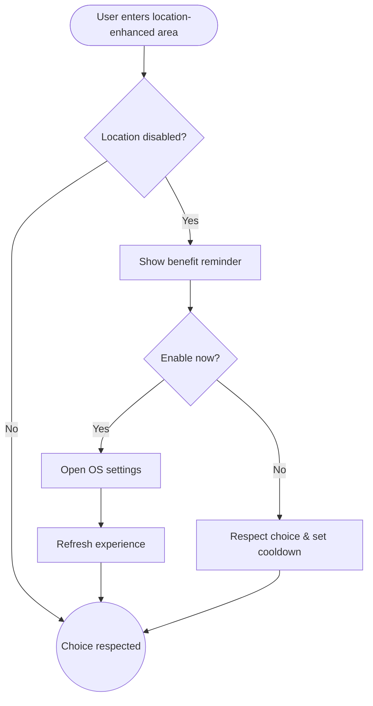

import FeatureSummary from '@site/src/components/FeatureSummary';

# Geo Allow Follow-up

## One-Glance Summary

<FeatureSummary />

## Narrative
Geo Allow Follow-up offers a respectful path to enable location after a user said no. Instead of repeating the system prompt, we explain how the globe personalizes with location and provide a direct link to settings.

The tone stays invitational so users feel in control. They can enable permission with one tap or dismiss without friction.

## Interaction Blueprint
1. Detect experiences (Light Map, localized missions) where location adds value for users who have declined permissions.
2. Present a lightweight banner or modal with copy explaining the benefit and privacy measures.
3. Offer actions: “Enable location” (launch OS settings) and “Not now”.
4. Record the response; if re-enabled, refresh the globe view immediately.
5. Respect cooldown periods to avoid nagging users repeatedly.
6. Provide alternate experiences (e.g., global view) when location remains disabled.

:::caution Edge Case
Device restrictions prevent direct navigation to settings. Provide manual instructions and a support link.
:::

:::tip Signals of Success
- Permission enablement rises after the follow-up prompt without increasing opt-outs.
- Confusion about a generic globe view drops.
- Users report feeling respected instead of pressured.
:::

### Journey

## Requirements & Guardrails
- **Acceptance criteria**
  - GIVEN location is disabled WHEN the user lands on the globe THEN the follow-up prompt appears only after they interact, not immediately.
  - GIVEN a user selects Enable WHEN OS settings open THEN copy explains how to toggle and the app listens for changes to refresh automatically.
  - GIVEN repeated deferrals WHEN cooldown expiry hits THEN the prompt reappears with updated context, not sooner.
- **No-gos & risks**
  - Triggering the system permission dialog repeatedly without user action.
  - Using alarmist language that pressures compliance.
  - Forgetting to update the interface after permissions change, leaving users uncertain.

## Data & Measurement
- Primary metric: Successful enablement rate following the follow-up prompt.
- Secondary checks: Cooldown adherence, dismiss rates, and qualitative perception of helpfulness.
- Telemetry requirements: Log prompt impressions, user choices, setting change detection, and cooldown resets.

## Open Questions
- What cooldown window best balances helpful reminders with user autonomy (e.g., 7 days)?
- Should we tailor messaging based on why the user declined originally if known?
