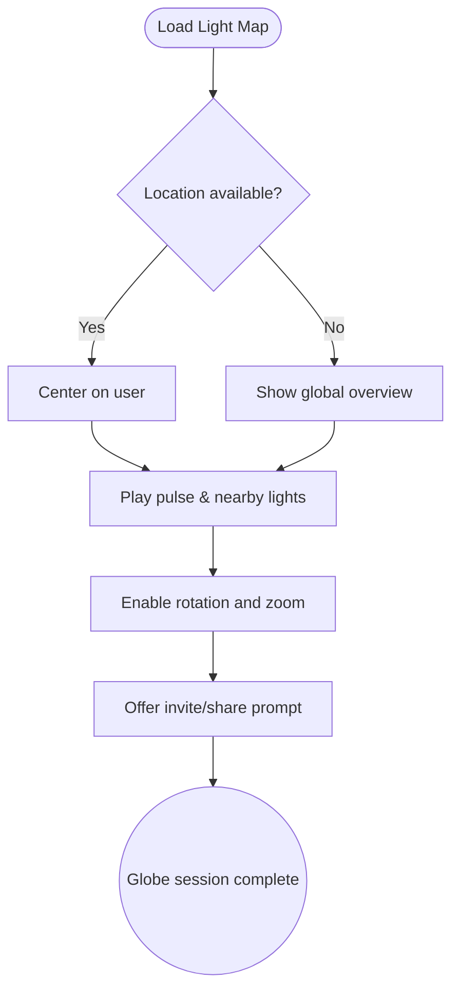

import FeatureSummary from '@site/src/components/FeatureSummary';

# Globe

## Summary

<FeatureSummary />

## Narrative
The Globe is the living map of AWATERRA. It centers on the practitioner, pulses with their latest contribution, and shows nearby lights so the community feels close.

It serves as the onboarding wow moment, daily home base, and gentle prompt to invite friends. Every visual treatment, from golden pulses to expanding ripples, signals that practice has real impact.

## Interaction
1. Acquire permissioned location data or fall back to a global overview if unavailable.
2. Render the user’s position and animate a golden pulse with expanding rings after each practice.
3. Overlay surrounding participants and data layers (Pulse rate, last practice timestamps) with graceful transitions.
4. Provide controls for rotate, zoom, and pan, tuned for touch gestures and accessibility.
5. Surface a call-to-action such as “Invite a friend” tied to the current practice moment.
6. Continuously sync telemetry so the globe remains fresh without draining device resources.

:::caution Edge Case
Location permissions are denied. Present a global view with gentle prompts to enable sharing while preserving agency.
:::

:::tip Signals of Success
- Globe loads within performance budgets and maintains smooth frame rates.
- User location accuracy stays within acceptable thresholds or provides a clear fallback.
- Invite actions and repeat visits increase after users see the visualization.
:::

### Journey

## Requirements
- **Acceptance criteria**
  - GIVEN a granted location WHEN the globe loads THEN it centers on the user with pulse animation and updated metadata.
  - GIVEN denied permissions WHEN the globe loads THEN it presents a respectful global overview with optional enablement guidance.
  - GIVEN rapid user interactions WHEN the globe responds THEN framerate and touch responsiveness stay within experience targets.
- **No-gos & risks**
- Revealing precise coordinates that compromise privacy. Always obfuscate to community-safe granularity.
  - Overly heavy shaders or particle counts that drop performance below acceptable FPS.
  - Visual clutter that obscures context or overwhelms users unfamiliar with 3D navigation.

## Data
- Primary metric: Successful globe render rate with location contextualization (or safe fallback) per session.
- Secondary checks: Average FPS, invite CTA interactions, time spent exploring the map.
- Telemetry requirements: Log load outcomes, permission states, camera interactions, and performance diagnostics.

## Open Questions
- Should we personalize globe overlays (e.g., practice streaks) for returning users in v0.1?
- How often should the home scene poll for updates to balance freshness with battery use?
