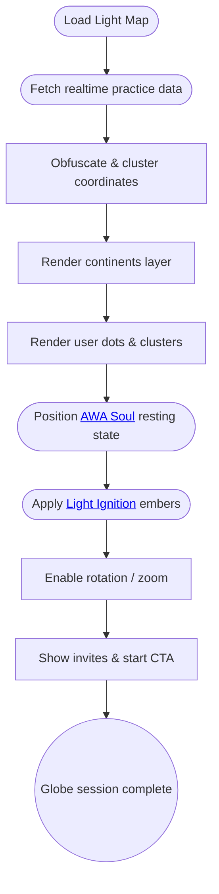

import FeatureSummary from '@site/src/components/FeatureSummary';

# Globe

## Summary

<FeatureSummary />

## Narrative
The Globe is the living map of AWATERRA powered by real participant data. It completes the welcome story that AWA Soul begins, fading in on the same canvas once onboarding finishes. From there it anchors the home screen, pulses with the user’s practice, and shows nearby lights so the community feels close.

The visualization stacks four layers:
- **Continents layer** — a calm earth mesh with minimal political boundaries.
- **Presence layer** — real user locations reduced to community-safe granularity, clustered when density is high to preserve performance and privacy.
- **AWA Soul layer** — the resting state of the guide hovering above the user’s region ready to rise for practice.
- **Light Ignition layer** — bright embers for users whose practice ignited within the last 24 hours, fading to glimmers as timers expire.

After each session the globe animates Light Ignition, updates the presence layer with the actual completion event, and keeps the user anchored in place. Onboarding → home → practice → celebration all share this surface so the sense of place never breaks.

## Interaction
1. Hand off from AWA Soul’s onboarding state and keep the camera fixed so the user recognizes the same world they saw during the welcome sequence.
2. Fetch the latest, permissioned practice data (user location, recent completions) via the realtime map service; apply obfuscation and clustering before rendering.
3. Render layers in order—continents → clustered presence dots → resting AWA Soul → Light Ignition embers—so overlaps always feel intentional.
4. When a practice completes, update the user’s node in place, trigger the Light Ignition layer, and broadcast the refresh to [Profile View](./profile-view.md).
5. Provide rotate, zoom, and pan tuned for touch and accessibility, including focus snaps to the user’s light when available.
6. Surface calls-to-action such as “Invite a friend” and “Start practice” within the bottom card while the globe remains visible, and stream incremental updates without draining battery.

:::caution Edge Case
Location permissions are denied. Present a global view with gentle prompts to enable sharing while preserving agency; keep clustering active for remote updates.
:::

:::tip Signals of Success
- Globe loads within performance budgets and maintains smooth frame rates.
- Real user activity appears within seconds of completion while respecting anonymization.
- Invite actions and repeat visits increase after users see nearby participation.
:::

### Journey

## Requirements
- **Acceptance criteria**
  - GIVEN a granted location WHEN the globe loads THEN it centers on the user with obfuscated coordinates, current Light Ignition state, and clustered neighbors rendered within one second.
  - GIVEN denied permissions WHEN the globe loads THEN it presents a respectful global overview using anonymized aggregate data and communicates how to enable sharing.
  - GIVEN new practice data arrives WHEN the map session is active THEN the presence and Light Ignition layers update without reloading the scene or dropping below target FPS.
- **No-gos & risks**
  - Revealing precise coordinates that compromise privacy; always apply obfuscation and clustering thresholds.
  - Overly heavy shaders or particle counts that drop performance below acceptable FPS.
  - Visual clutter that obscures context or overwhelms users unfamiliar with 3D navigation.

## Data
- Primary metric: Percentage of globe sessions that ingest fresh practice data and render updated layers within SLA.
- Secondary checks: Average FPS, cluster accuracy (users per cluster vs. source data), invite CTA interactions, time spent exploring the map.
- Telemetry requirements: Log data fetch success, clustering operations, layer render times, permission states, and camera interactions.

## Related Feature Docs
- [AWA Soul](./awa-soul.md) — resting guide rendered above the globe.
- [Light Ignition](./light-ignition.md) — embers that influence the globe’s bright layer.
- [Profile View](./profile-view.md) — home canvas that shares the same globe state.
- [Practice Screen](./practice-screen.md) — source of new completions that update the map.
- [Push Fading Light Reminder](./push-fading-light-reminder.md) — notifications triggered when lights begin to dim.

## Open Questions
- Should we personalize globe overlays (e.g., practice streaks) for returning users in v0.1?
- How often should the home scene poll for updates to balance freshness with battery use?
