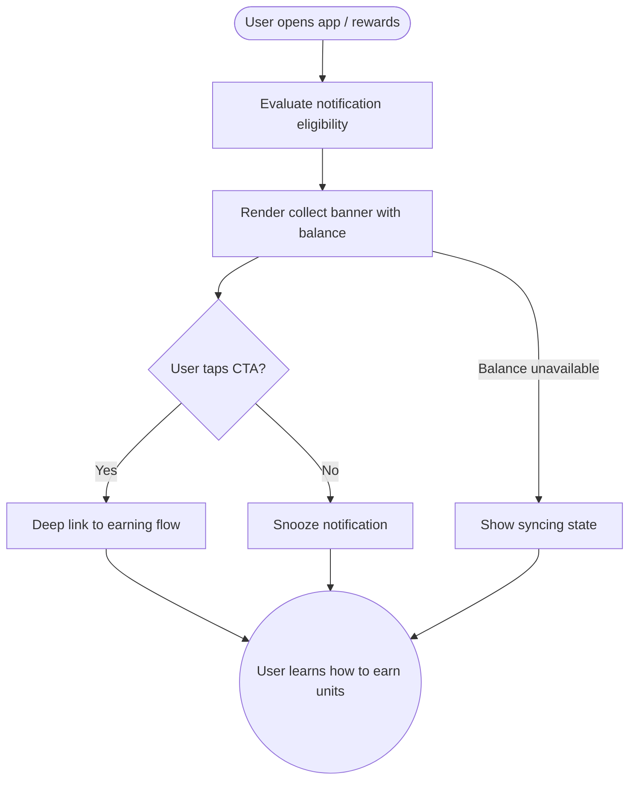

import FeatureSummary from '@site/src/components/FeatureSummary';

# In-App Notification for Collecting Lumens

## Summary

<FeatureSummary />

## Narrative
The collecting notification is a teachable nudge. When a user opens the app or explores rewards, a lightweight banner explains how to gain more Lumens, shows the current balance, and points toward meaningful earning actions.

Copy remains actionable and context-aware so it feels like guidance, not spam. The component lives within the notification center and can also appear inline on the rewards screen for quick reinforcement.

## Interaction
1. User opens the app or visits rewards; the notification service checks whether the collect reminder should appear.
2. The banner surfaces balance, recent earning actions, and one or two suggested tasks.
3. User can tap "See ways to earn" to jump into practices, missions, or referral prompts.
4. Dismissing the banner snoozes it for the configured time window to avoid repetition.
5. Notification center logs the delivery so we can personalize cadence later.
6. If the user completes an earning action immediately, the banner updates or gracefully disappears.
7. Analytics capture impression, clicks, and conversion into the highlighted action.

:::caution Edge Case
If the balance API fails, display educational copy with "Syncing units" instead of the amount and avoid linking to spend flows until the value returns.
:::

:::tip Signals of Success
- Users understand at least one way to earn more units after seeing the banner.
- Click-through to earning flows increases relative to the control group.
- Negative feedback or dismissals stay low thanks to smart cadence.
:::

## Journey

## Requirements
- **Acceptance criteria**
  - GIVEN a user qualifies for the reminder WHEN they open the app THEN the banner appears within the first screen and displays the current balance.
  - GIVEN the user taps the CTA WHEN they return THEN we do not re-show the same reminder for the cooldown period.
  - GIVEN the balance service cannot respond WHEN rendering THEN the banner switches to the syncing fallback but still provides educational copy.
- **No-gos & risks**
  - Over-delivery may desensitize users; respect personalization rules.
  - Displaying outdated balances undermines trust in currency data.
  - Linking directly to spend flows would confuse users in a collecting context.

## Data
- **Primary metric:** Click-through rate from notification to earning flows.
- **Secondary checks:** Dismiss rate, conversion into earning actions, snooze duration adherence, and satisfaction score trends.
- **Telemetry requirements:** Log impression timestamp, eligibility reason, balance displayed, CTA tapped, conversion event ID, snooze/dismiss reason, and fallback usage.

## Open Questions
- Should the reminder adapt copy based on the user's most common earning action?
- How long should the snooze window remain for 0.4?
