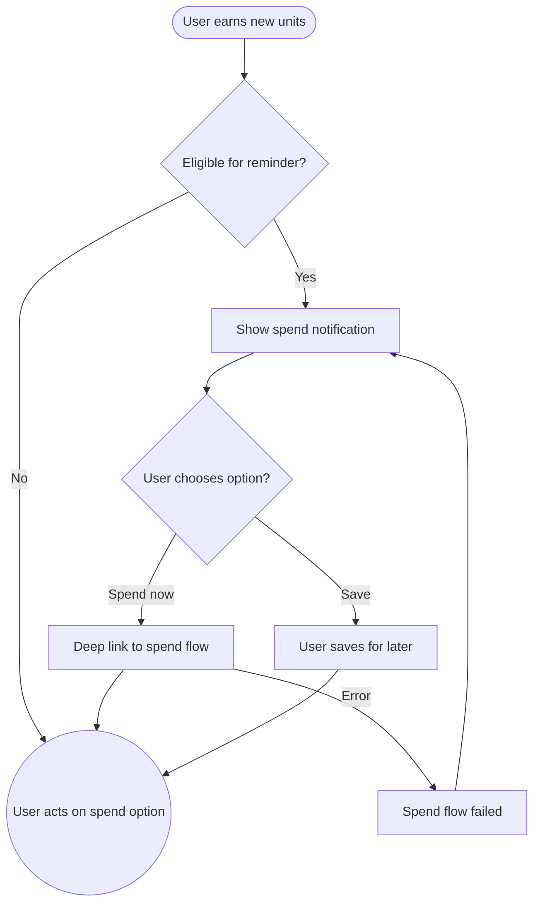

import FeatureSummary from '@site/src/components/FeatureSummary';

# In-App Notification for Spending Lumens

## Summary

<FeatureSummary />

## Narrative
Right after users earn units we remind them of meaningful ways to spend. The spending notification appears inside the app with contextual options like supporting a Master or boosting the Pulse, highlighting the emotional story behind the economy.

The experience keeps agency in the user's hands: clear options, a quick peek at their new balance, and a link to the detailed rewards section if they are not ready yet.

## Interaction
1. Ledger signals that new units landed in the user's balance.
2. Notification service checks eligibility rules (time since last spend reminder, minimum balance).
3. Banner or card appears with current balance, congratulatory copy, and two spend CTAs.
4. Tapping a CTA deep-links into the relevant spend flow (Master tipping, Pulse support, future rewards store).
5. User can snooze or dismiss; we record preference to avoid immediate repeats.
6. If the user spends directly, the notification confirms the deduction and disappears.
7. Fallback copy thanks the user even if they decide to save units for later.

:::caution Edge Case
If the spend flow fails (e.g., network), keep the notification pinned with an error chip and let the user retry rather than deducting units prematurely.
:::

:::tip Signals of Success
- Users immediately understand at least one spend option after receiving units.
- Conversion from earning to spend flows increases, especially within the same session.
- Dismissal rate stays low because timing feels respectful.
:::

## Journey

## Requirements
- **Acceptance criteria**
  - GIVEN a user crosses the earn threshold WHEN rules allow THEN the notification appears with at least two contextual spend options.
  - GIVEN the user taps a CTA WHEN the deep link opens THEN their balance state is passed through so the spend screen does not refetch unnecessarily.
  - GIVEN the spend action errors WHEN the user returns THEN the notification persists with a retry banner until success or dismissal.
- **No-gos & risks**
  - Showing the reminder before units actually settle could lead to overdrafts.
  - Pushing too aggressively might feel like a sales tactic; maintain calm tone.
  - Linking to unavailable spend features frustrates users; keep eligibility checks up to date.

## Data
- **Primary metric:** Conversion rate from spend notification to completed spend action.
- **Secondary checks:** Dismissal rate, snooze adherence, retry frequency after failures, and time-to-spend after alert.
- **Telemetry requirements:** Log balance at notification time, spend options surfaced, CTA tapped, completion status, error types, and snooze/dismiss actions.

## Open Questions
- Do we prioritize certain spend options based on user history or rotate evenly?
- How long after earning should we wait before sending the reminder to avoid overlap with completion moments?
