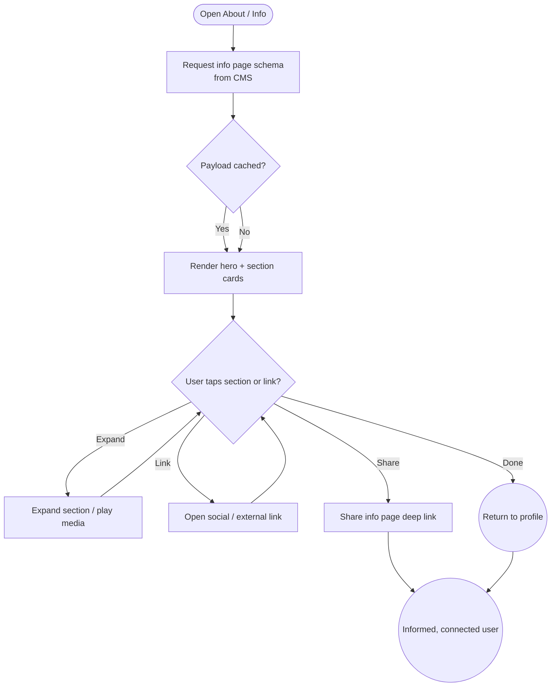

import FeatureSummary from '@site/src/components/FeatureSummary';

# Info Page v0.2

## Summary

<FeatureSummary />

## Narrative
Info Page v0.2 replaces static “About” copy with a living narrative of AWATERRA’s mission, team, and community channels. The page pulls from the CMS so marketing can adjust storytelling, add event highlights, or swap social links without engineering help. Sections include a mission statement, founder spotlight, community pathways (Telegram, Instagram, YouTube), and a “How practice works” overview with imagery. The page lives inside the profile area and becomes a go-to reference when users invite friends or explain the product.

Localization matters: Russian and English content render side by side based on device locale, and optional audio snippets let masters narrate the vision. The layout favors calm reading with cards that expand for deeper dives. Analytics capture which sections resonate to guide future updates.

## Interaction
1. User taps “About AWATERRA” from Profile or onboarding’s curiosity prompt.
2. Client fetches the info-page schema from CMS, including ordered sections, copy, media, and link metadata.
3. The page renders hero section (mission statement), followed by cards (Our Approach, Meet the Masters, Community Channels, Press & Support).
4. Tapping a card expands subcontent (quotes, timelines, videos) while keeping the calm tone; external links open in-app webviews or native apps as applicable.
5. When offline, the page shows cached content with a subtle badge; links queue and open once connectivity returns.
6. Users can share the page via deep link; the system records the event for growth analytics.

:::caution Edge Case
If the CMS payload references an unsupported media type, the client replaces it with a gentle placeholder and flags the issue to admins; the page should never break layout.
:::

:::tip Signals of Success
- Users spend ≥30 seconds on the page on average, indicating meaningful engagement.
- Social link taps grow community channels without harming practice completion.
- Marketing updates propagate within minutes of publish without app releases.
:::

### Journey

## Requirements
- **Acceptance criteria**
  - GIVEN the user opens the Info page WHEN the CMS responds THEN sections render in the configured order with localized copy, imagery, and social buttons.
  - GIVEN marketing updates the CMS WHEN the page reloads THEN new content appears without requiring an app update.
  - GIVEN the device is offline WHEN cached content exists THEN the page shows cached text with an offline badge and defers external links.
- **No-gos & risks**
  - Hardcoding links or copy that drift from CMS-managed content.
  - Embedding heavy media that hurts load times; enforce size limits.
  - Omitting accessibility support (alt text, voiceover labels) for images and buttons.

## Data
- Primary metric: Info page engagement rate (unique viewers ÷ active users per week).
- Secondary checks: Section expansion counts, social link taps, share events, and bounce rate (view under 5 seconds).
- Telemetry requirements: Log schema version, section impressions, expansion events, outbound link usage, share actions, and offline fallbacks.

## Open Questions
- Should we add “Upcoming events” dynamic sections or keep to static storytelling for 0.2?
- Do we support audio narration in 0.2 or treat it as a follow-up enhancement?
- How do we integrate feedback from this page into marketing roadmaps (e.g., quick poll)?
