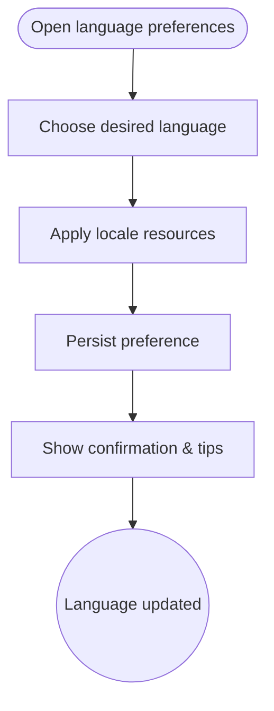

import FeatureSummary from '@site/src/components/FeatureSummary';

# Language Settings

## One-Glance Summary

<FeatureSummary />

## Narrative
Language Settings helps AWATERRA feel native in every supported language. Users can switch between locales during onboarding or from settings, and the interface updates right away.

The control also explains how to request more languages and invites feedback from communities that need broader support.

## Interaction Blueprint
1. Surface the language selector during onboarding with default based on device locale.
2. Offer a compact list of available languages with preview copy and accessibility notes.
3. Apply the chosen language immediately, refreshing strings, layouts, and date/number formats.
4. Persist the preference to user profile so all devices load the same locale.
5. Provide a fallback mechanism if translations are missing, coupled with graceful messaging.
6. Log changes for analytics to prioritize future localization investments.

:::caution Edge Case
A translation key is missing. Fall back to the default language while flagging the gap for content teams.
:::

:::tip Signals of Success
- Language changes occur without restarts or broken layouts.
- Localization QA finds minimal truncation or clipping issues.
- Feedback loops capture demand for additional languages.
:::

### Journey

## Requirements & Guardrails
- **Acceptance criteria**
  - GIVEN a user selects a new language WHEN confirmed THEN the entire UI updates immediately and persists across sessions.
  - GIVEN unsupported language requests WHEN surfaced THEN the UI provides a respectful response and capture mechanism.
  - GIVEN reduced-motion or accessibility settings WHEN language changes THEN typography and layout still meet standards for legibility.
- **No-gos & risks**
  - Mixing locales within a single screen due to partial translations.
  - Hardcoding text that bypasses localization pipelines.
  - Ignoring right-to-left or long-string considerations as we add languages.

## Data & Measurement
- Primary metric: Successful language switch rate without requiring a restart.
- Secondary checks: Frequency of language changes, localization bug reports, and time-to-fix missing keys.
- Telemetry requirements: Log selection events, fallback occurrences, and layout warnings triggered by translation length.

## Open Questions
- Should language selection tie into upcoming content recommendations (e.g., region-specific practices)?
- How do we signal to users when new languages become available post-launch?
