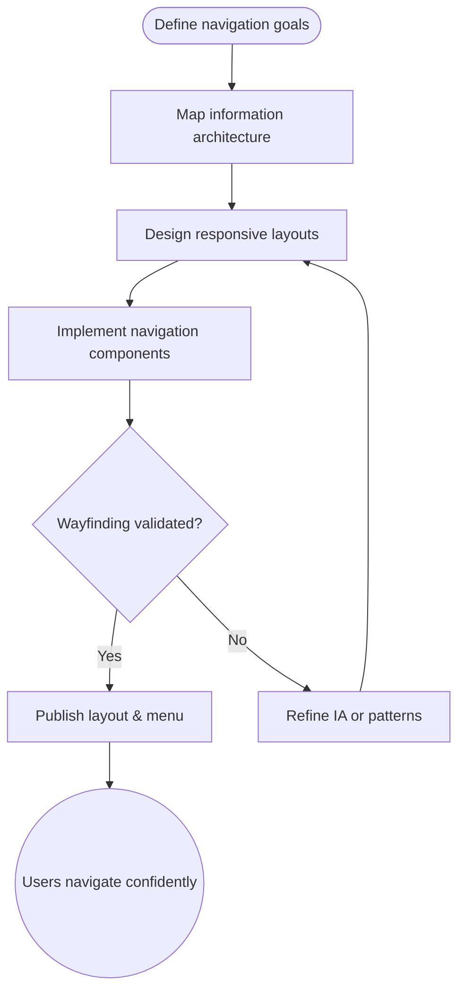

import FeatureSummary from '@site/src/components/FeatureSummary';

# Layout & Menu

## One-Glance Summary

<FeatureSummary />

## Narrative
Layout & Menu defines the foundation of AWATERRA’s navigation experience. The structure must balance clarity and calmness so practitioners can find what they need without cognitive overload. This first release anchors the global navigation, surfaces the most important destinations, and establishes responsive patterns for future modules.

Beyond basic wayfinding, the menu educates users on the breadth of the product—practices, pulse, profile, and admin surfaces—while keeping the spiritual tone intact. Consistent placement, motion, and iconography set expectations that future features can inherit without rework.

## Interaction Blueprint
1. Align stakeholders on the launch IA and map it to user journeys and permissions.
2. Design responsive layout shells for mobile-first usage with scalable breakpoints.
3. Implement navigation components, including icons, labels, and active-state cues.
4. Wire navigation routes, deeplinks, and analytics tracking for each destination.
5. Exercise typical and edge navigation paths with usability tests and accessibility audits.
6. Load the layout in production-like environments to confirm performance and localization resilience.

- Edge case: A locale introduces long labels that break layout; responsive truncation and tooltips preserve clarity without clipping.

- Signals of success:
  - Users identify their current location and upcoming steps without assistance.
  - Navigation adjusts gracefully across device sizes and orientations.
  - Analytics show balanced engagement across primary destinations.

### Mermaid Journey IN MERMAID FORMAT

## Requirements & Guardrails
- **Acceptance criteria**
  - GIVEN a first-time user WHEN the app opens THEN the layout indicates the available sections and active view.
  - GIVEN a screen rotation or form-factor change WHEN the menu reflows THEN controls remain usable and accessible.
  - GIVEN analytics dashboards WHEN navigation events stream THEN destinations and deeplinks are captured accurately.
- **No-gos & risks**
  - Overloading the top-level menu confuses early adopters and dilutes focus.
  - Inconsistent iconography or labels erodes the mindful tone we aim to uphold.
  - Ignoring accessibility standards (contrast, hit areas, focus order) limits who can benefit.

## Data & Measurement
- Primary metric: Successful navigation rate to key destinations (Practices, Pulse, Profile) per session.
- Secondary checks: Time-to-first-action after launch, menu interaction drop-off, and accessibility audit scores.
- Telemetry requirements: Instrument navigation taps, deeplink entries, and screen transitions.

## Open Questions
- Do we introduce quick shortcuts for returning practitioners in v0.1 or defer to a later release?
- Which sections, if any, should remain hidden for guests versus registered members at launch?
