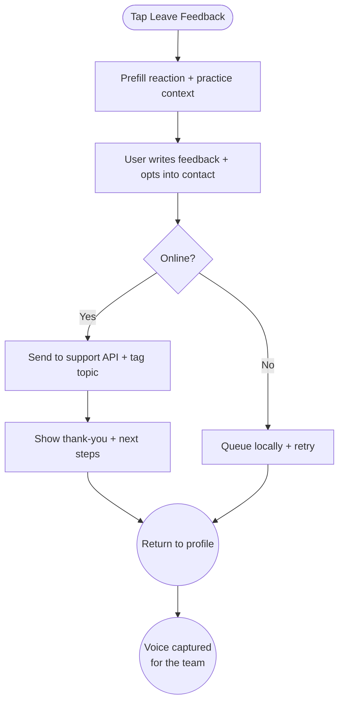

import FeatureSummary from '@site/src/components/FeatureSummary';

# Leave Feedback

## Summary

<FeatureSummary />

## Narrative
Leave Feedback gives users a gentle way to tell us what’s working or where they need help. The entry point appears on Profile View, within the What’s New deck, and at the end of practice reactions. The form keeps the tone supportive: a short intro (“We’d love to hear how you feel”) followed by optional prompts (What did you love? What could be smoother?). The user can include their latest reaction state automatically so support sees context without extra typing.

Feedback routes through the support backend with tags for topic (content, app experience, emotions) and urgency. Users can opt into follow-up by providing email/Telegram; otherwise the submission stays anonymous. We also show quick links to FAQ and Info for self-service. Successful submissions end with a thank-you animation and a suggestion to log another practice or explore updates.

State tags reuse the [Reactions Taxonomy](/docs/wiki/reactions/) so support teams can slice reports by the same language product and analytics rely on.

## Interaction
1. User taps “Leave feedback”; the form slides up overlaying the current context.
2. App pre-fills the latest reaction state and practice name (if relevant); user can toggle them off.
3. User enters text (min 20 characters encouraged) and optionally attaches a screenshot or audio note.
4. Optional contact field lets them enter email/Telegram; GDPR notice clarifies usage.
5. On submit, the app sends payload to support API; loader shows progress and error handling for offline mode (stores locally and retries).
6. Confirmation screen thanks the user, offers quick links (FAQ, Info, Start practice), and logs telemetry.

:::caution Edge Case
If the user is offline, the form stores the submission securely and marks it “Sending soon”; a notification confirms once sync succeeds, with clear messaging that no data left the device yet.
:::

:::tip Signals of Success
- Feedback volume increases while keeping quality high (less one-word submissions).
- Support can triage faster because reactions + practice context travel with each ticket.
- Users report feeling heard, measured via follow-up satisfaction polls.
:::

### Journey

## Requirements
- **Acceptance criteria**
  - GIVEN a user opens the form WHEN their latest reaction exists THEN it pre-fills with the state and practice, which they can remove before submitting.
  - GIVEN the user submits feedback WHEN online THEN the API receives the payload with topic tags, reaction state, and optional contact info, returning success to the client.
  - GIVEN the user is offline WHEN they submit THEN the app saves the entry locally, clearly indicates pending sync, and retries automatically once connected.
  - GIVEN support resolves the feedback WHEN they respond THEN the system logs status and optionally notifies the user if they opted into follow-up.
- **No-gos & risks**
  - Collecting personal contact info without explaining usage or storing it securely.
  - Ignoring submissions; support workflows must acknowledge and triage within SLA.
  - Making the form feel like a survey; language should be warm and optional.

## Data
- Primary metric: Feedback submission rate (submissions ÷ weekly active users).
- Secondary checks: Contact opt-in rate, response time, resolution satisfaction, and offline queue success.
- Telemetry requirements: Log form opens, prefill toggles, submission outcomes, attachment types, offline queue events, and follow-up notifications.

## Open Questions
- Should we route positive feedback to masters automatically or keep it filtered?
- Do we add quick sentiment toggles (“Loved it”, “Needs polish”) before free text?
- How do we close the loop visibly in-app when a suggestion ships?
