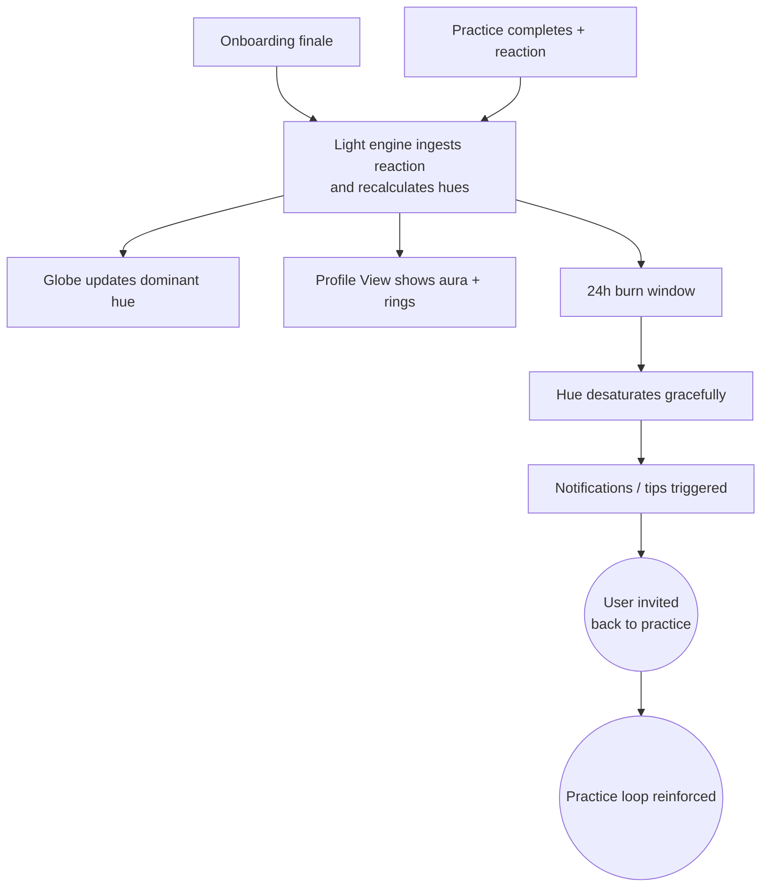

import FeatureSummary from '@site/src/components/FeatureSummary';

# Light Ignition v0.2

## Summary

<FeatureSummary />

## Narrative
Light Ignition v0.2 keeps the spark from v0.1 but now colours it with the latest reaction, showing stacked feelings on the globe and profile for the past 24 hours. Each new practice blends gently into the aura instead of snapping, so users can sense how their week is trending.

The engine listens to Practices Reactions Base, updates globe/profile/push payloads, and fades the hue calmly as the burn window ends. Colours and labels still come from the [Reactions Taxonomy](/docs/wiki/reactions/), keeping catalogue, history, and notifications aligned.

## Interaction
1. Onboarding finale introduces the seven-state palette: as the camera zooms out, the user’s spark cycles briefly through each hue before locking onto their starting state.
2. Practice completion posts a reaction; Light Ignition ingests the update, calculates the new dominant and supporting states, and broadcasts payloads to globe/profile surfaces.
3. Profile View renders the light with a colored aura matching the dominant state and a secondary ring for the runner-up, giving users quick context.
4. Globe clusters show aggregated hues when multiple co-located users practice; hovering or tapping reveals counts per state.
5. During the 24-hour burn, fades adjust saturation rather than switching to gray, telegraphing that energy is waning yet the feeling persists.
6. When the burn window ends, the ember returns to a neutral glow while instrumentation triggers reminder events (e.g., “Spark your Joy again”).

:::caution Edge Case
Back-to-back practices with different reactions must blend colors smoothly; the system averages by weight and animates transitions instead of snapping between hues.
:::

:::tip Signals of Success
- Light updates within one second of reaction submission on both globe and profile.
- Users recognize their dominant state color and can distinguish stacked experiences.
- Fade animations stay calm and never flash or stutter even on low-end devices.
:::

### Journey

## Requirements
- **Acceptance criteria**
  - GIVEN a reaction posts WHEN Light Ignition recalculates THEN the user’s globe spark updates hue and intensity within one second.
  - GIVEN multiple reactions within 24 hours WHEN the dominant state changes THEN the glow transitions via blended animation, not abrupt swaps.
  - GIVEN the burn window expires WHEN no new practices occur THEN the light shifts to ember while emitting notification events referencing the last dominant state.
- **No-gos & risks**
  - Color assignments that clash with accessibility guidelines or other UI elements.
  - Divergent state calculations between client and server; all logic must pull from Practices Reactions Base.
  - Hard fades to gray that feel punitive or panic-inducing.

## Data
- Primary metric: Time from reaction ingestion to light update across surfaces (target ≤1 s p95).
- Secondary checks: Distribution of dominant states, fade completion rate, and user engagement with follow-up notifications tied to hue changes.
- Telemetry requirements: Log ignition events with state weights, transition durations, fade start/end, and notification triggers.

## Open Questions
- Should we allow users to opt into multi-state displays (e.g., top three rings) in v0.2 or defer to later versions?
- Do we need offline-safe blending logic for spotty connections, or can the client rely on cached hue history?
- How do we visualize shared sessions (e.g., live circles) where multiple dominant states compete in the same locale?
