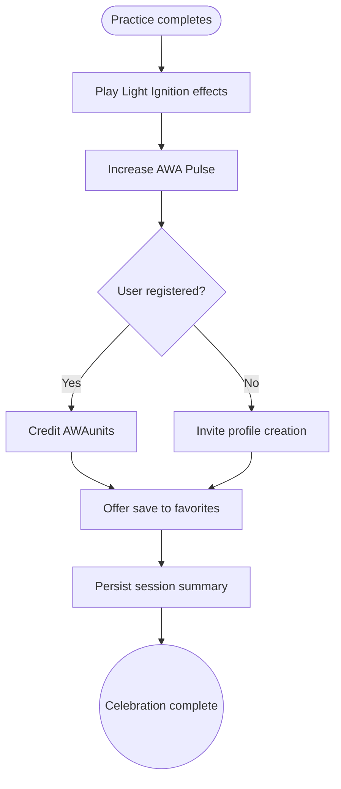

import FeatureSummary from '@site/src/components/FeatureSummary';

# Light Ignition

## Summary

<FeatureSummary />

## Narrative
Light Ignition turns each completed practice into a calm celebration. The globe flashes, the Pulse lifts, and AWAunits reach the wallet so progress feels tangible. Registered members unlock deeper rewards while guests still feel their contribution.

We keep the moment clear by recapping streaks, rewards, and favorites without overwhelming the user. Effects stay soothing, timing is deliberate, and accessibility cues keep everyone included.

## Interaction
1. Detect completion of the guided 10-minute morning practice.
2. Trigger Light Vision animation on the globe and overlay celebratory effects.
3. Increment AWA Pulse and surface momentary metrics that show the community uplift.
4. Credit AWAunits for registered users and prompt guests to create a profile to retain rewards.
5. Offer options to favorite the session and respect tier limits (3 for Free, unlimited for Journey).
6. Persist the session summary, update streak counters, and reset the interface for the next action.

:::caution Edge Case
Simultaneous completions overwhelm the pulse animation. Throttle visual intensity while still logging each contribution.
:::

:::tip Signals of Success
- Every session produces a reliable visual flash and Pulse update.
- Wallet balances reflect credited AWAunits within seconds for registered members.
- Favorites honor tier limits without blocking joyful completion.
:::

### Journey

## Requirements
- **Acceptance criteria**
  - GIVEN a completed practice WHEN Light Ignition fires THEN globe animations, Pulse uplift, and session summary appear within 1 second.
  - GIVEN a registered user WHEN rewards credit THEN wallet and streak values update before the user leaves the screen.
  - GIVEN a guest user WHEN the reward modal appears THEN the copy clearly explains what is forfeited without pressure.
- **No-gos & risks**
  - Overwhelming audio/visual stimuli that contradict the mindful tone.
  - Inconsistent reward accounting that erodes trust in the system.
  - Accessibility regressions (flashes, color contrast) that exclude sensitive users.

## Data
- Primary metric: Percentage of completed practices that successfully trigger Light Ignition events.
- Secondary checks: Reward settlement latency, favorite conversion rate, and Pulse uplift per session.
- Telemetry requirements: Log practice completion triggers, reward distribution outcomes, and animation timing.

## Open Questions
- Should we vary Light Ignition effects by practice type or keep a single motif for v0.1?
- How long should celebratory elements remain on screen before gracefully fading?
