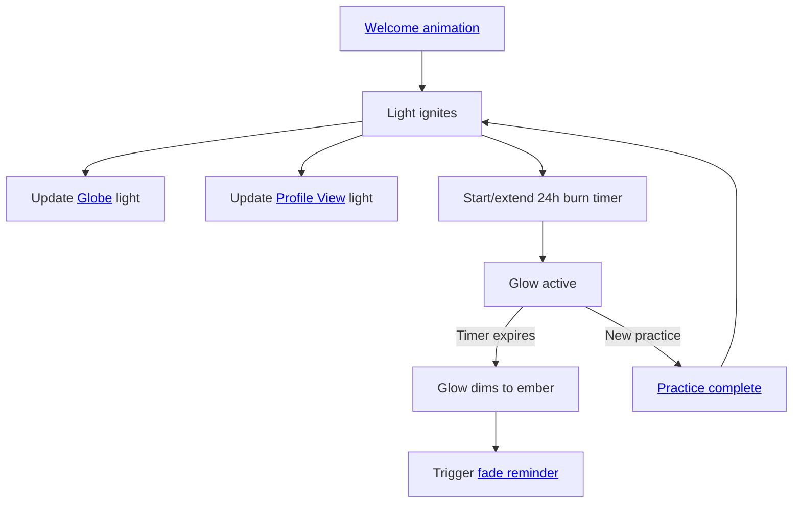

import FeatureSummary from '@site/src/components/FeatureSummary';

# Light Ignition

## Summary

<FeatureSummary />

## Narrative
Light Ignition is the living ember that follows a person through the product. During onboarding the camera is tight on their light, we zoom out to reveal the constellation of the community, and the same glow anchors the globe when they arrive on [Profile View](./profile-view.md). Every practice they complete re-ignites their light, keeping it bright on the globe and in the home hero for 24 hours. If they pause for longer, the ember softens, nudging them back through [push notifications](./push-fading-light-reminder.md) and daily rituals.

Light Ignition carries one simple promise: “Keep practicing and your light stays bright.” No alternate practice variants or separate reward flows are required—just the glow that breathes across onboarding, globe, and home.

## Interaction
1. During the final beat of onboarding, frame the user's light at single-spark scale, then ease the camera out to reveal nearby souls while seeding the globe state.
2. When any practice finishes, trigger Light Ignition on the practice surface, then immediately mirror the refreshed glow on the globe and [Profile View](./profile-view.md).
3. Start or extend a 24-hour burn window each time the light ignites; store the expiry so other systems (globe, notifications, analytics) respect the same timer.
4. Show the bright state continuously during the burn window, then fade the pulse to the “glimmer” state once the timer passes without a new practice.
5. Publish light-state events so [push notifications](./push-fading-light-reminder.md) can invite the user back before their glow fades.

:::caution Edge Case
Rapid back-to-back practices must extend the burn seamlessly without flicker or restarting the onboarding animation pacing.
:::

:::tip Signals of Success
- Lights ignite within a second of practice completion and stay synced across onboarding replay, globe, and home.
- 24-hour decay feels gentle: users notice the dimming but are never startled by harsh cutoffs.
- Push reminders triggered by fading lights show healthy return-to-practice rates.
:::

### Journey

## Requirements
- **Acceptance criteria**
  - GIVEN onboarding completes WHEN the final welcome line lands THEN Light Ignition zooms from single spark to constellation and seeds the globe state used on Profile View.
  - GIVEN a practice finishes WHEN Light Ignition fires THEN the globe and Profile View lights refresh within one second using the shared 24-hour timer.
  - GIVEN multiple practices occur within the burn window WHEN the next ignition starts THEN the timer extends without visual flicker or resets to a dim state.
  - GIVEN the burn window expires WHEN no new practice occurs THEN the glow transitions to the ember state and emits a reminder event for notifications and analytics.
- **No-gos & risks**
  - Competing reward or badge layers that distract from the single-light concept.
  - Bright-to-dim transitions that feel abrupt or punitive.
  - Mismatched timers between globe, home, and notification systems.

## Data
- Primary metric: Percentage of practices that ignite the light and sync surfaces without delay.
- Secondary checks: Average duration lights stay bright, return-to-practice rate within 24 hours of a fade reminder, and frequency of timer desynchronization.
- Telemetry requirements: Log ignition source (onboarding or practice), timer start/end, surface sync timestamps, and reminder dispatches.

## Related Feature Docs
- [Welcome Animation](./welcome-animation.md) — establishes the first Light Ignition reveal.
- [Globe](./globe.md) — displays the bright and ember states across the world view.
- [Profile View](./profile-view.md) — home surface that mirrors the light for 24 hours.
- [Practice Screen](./practice-screen.md) — endpoint that triggers each new ignition.
- [Push Fading Light Reminder](./push-fading-light-reminder.md) — notification cadence tied to the burn timer.

## Open Questions
- Should dimming use color temperature shifts, opacity, or both for the first release?
- How do we visualise overlapping household or co-located lights without losing individual ownership?
