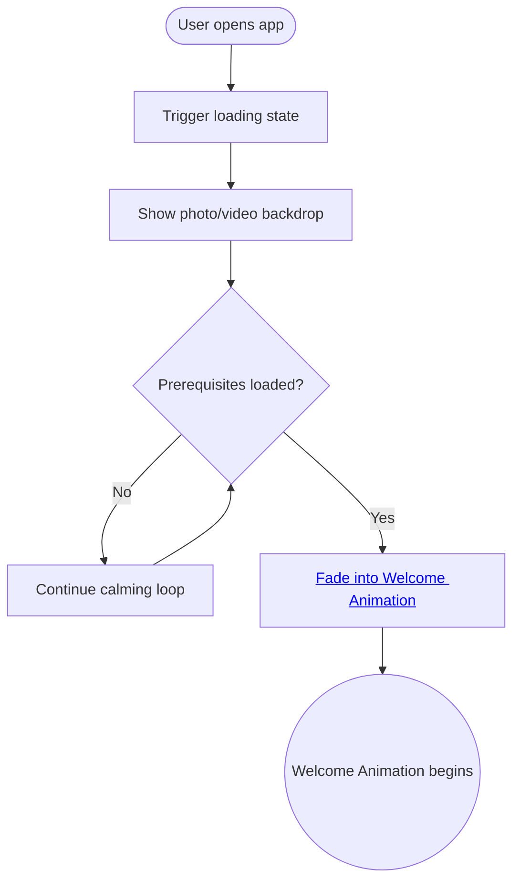

import FeatureSummary from '@site/src/components/FeatureSummary';

# Loading Screen

## Summary

<FeatureSummary />

## Narrative
The Loading Screen welcomes the user while the app initializes and sets up the single-screen onboarding canvas. Calm copy, ambient audio, and a still or gently looping video from the AWATERRA library—no abstract placeholders—make the wait feel intentional instead of idle.

When initialization completes we fade directly into the Welcome Animation without changing scenes, so the flow from loading → typing intro → globe reveal is seamless.

## Interaction
1. Detect when the user opens the app for the first time in a session (cold start or post-update) and initialize the loading state. Do not reuse this surface for in-app feature loads—use skeleton placeholders instead.
2. Display the first frame with a curated photo or looping video as the backdrop and the calming welcome message. There is no pulsing light; the visual remains steady to settle the user before the animation begins.
3. Keep the loading experience focused on grounding visuals only; narrative copy remains minimal until the [Welcome Animation](./welcome-animation.md) begins.
4. Monitor initialization state and update copy if additional time is needed.
5. Fade out the loading sequence once prerequisites complete and transition into the Welcome Animation.
6. Record whether the sequence has been shown before to avoid repetition when unnecessary.

:::caution Edge Case
Slow network extends load time. Show a calming loop with honest messaging instead of freezing the visual.
:::

:::tip Signals of Success
- New users experience a welcoming sequence without visible stutter.
- Repeat users see the screen only when needed; navigation stays fast otherwise.
- Support tickets about blank launch screens trend downward.
:::

### Journey

## Requirements
- **Acceptance criteria**
  - GIVEN a cold app start WHEN assets load THEN the welcome animation plays smoothly on the same surface without screen flashes.
  - GIVEN a returning user WHEN cached data is sufficient THEN the loading screen is skipped, preventing unnecessary delay.
  - GIVEN accessibility settings WHEN reduced motion is enabled THEN the animation simplifies without removing essential messaging.
- **No-gos & risks**
- Long unbroken waits without context increase churn; copy must set expectations.
  - Flashy or high-contrast visuals conflict with the calming tone.
  - Playing audio without consent could surprise users in quiet environments.
- Reusing the loading screen for in-app data fetches erodes trust; rely on skeletons and inline feedback elsewhere.

## Data
- Primary metric: Percentage of sessions where loading completes under the target threshold while the animation plays uninterrupted.
- Secondary checks: Average time spent on the loading sequence, opt-out/rage taps, and crash-free rate during initialization.
- Telemetry requirements: Log triggers, durations, fallback messaging usage, and whether the screen was shown or skipped.

## Open Questions
- Should we adapt messaging based on guest vs. registered state during v0.1?
- What is the minimum content required before transitioning to ensure screens never load partially?
