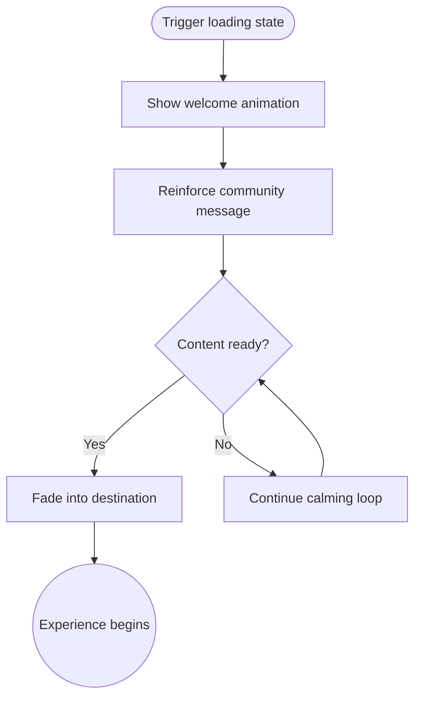

import FeatureSummary from '@site/src/components/FeatureSummary';

# Loading Screen

## One-Glance Summary

<FeatureSummary />

## Narrative
The Loading Screen welcomes the user while the app prepares content. Calm animations, warm copy, and soft audio make the wait feel intentional instead of idle.

We keep progress cues honest and responsive. As soon as tasks finish, the sequence fades away so the user arrives at the right spot without extra delay.

## Interaction Blueprint
1. Detect launch or feature transitions that require prefetching and initialize the loading state.
2. Display the first screen with pulsing light animation and the welcoming message.
3. Transition to the second screen reinforcing belonging and hinting at the community ahead.
4. Monitor data readiness and update progress indicators or copy if additional time is needed.
5. Fade out the loading sequence once prerequisites complete and transition into the destination experience.
6. Record whether the sequence has been shown before to avoid repetition when unnecessary.

:::caution Edge Case
Slow network extends load time. Show a calming loop with honest messaging instead of freezing the visual.
:::

:::tip Signals of Success
- New users experience a welcoming sequence without visible stutter.
- Repeat users see the screen only when needed; navigation stays fast otherwise.
- Support tickets about blank launch screens trend downward.
:::

### Journey

## Requirements & Guardrails
- **Acceptance criteria**
  - GIVEN a cold app start WHEN assets load THEN the welcome animation plays smoothly and transitions automatically once ready.
  - GIVEN a returning user WHEN cached data is sufficient THEN the loading screen is skipped, preventing unnecessary delay.
  - GIVEN accessibility settings WHEN reduced motion is enabled THEN the animation simplifies without removing essential messaging.
- **No-gos & risks**
  - Long unbroken waits without context increase churn; copy must set expectations.
  - Flashy or high-contrast visuals conflict with the calming tone.
  - Playing audio without consent could surprise users in quiet environments.

## Data & Measurement
- Primary metric: Percentage of sessions where loading completes under the target threshold while the animation plays uninterrupted.
- Secondary checks: Average time spent on the loading sequence, opt-out/rage taps, and crash-free rate during initialization.
- Telemetry requirements: Log triggers, durations, fallback messaging usage, and whether the screen was shown or skipped.

## Open Questions
- Should we adapt messaging based on guest vs. registered state during v0.1?
- What is the minimum content required before transitioning to ensure screens never load partially?
